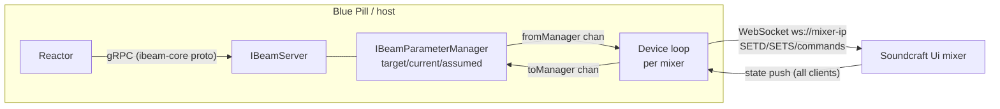

# IMPLEMENTATION.md — Design Notes & Protocol Reference

Agent/developer-oriented reference for building the Soundcraft Ui device core. Everything
here was extracted from the local clones in `reference/` (see README) during the research
phase on 2026-07-20. File citations point into `reference/` so they can be re-verified.

---

## 1. Architecture overview



Three layers, exactly mirroring `core-skaarhoj-template`:

1. **main.go** — CoreInfo branding, model registration, parameter registration, start
   manager + gRPC server (template default listen `:8502`; skaarOS production overrides to
   `/var/ibeam/sockets/<core>.socket` unless `IBEAM_CORE_ADDRESS` is set —
   `reference/ibeam-corelib-go/parameter-manager.go` ~L78).
2. **parameters.go** — parameter catalog (see §4).
3. **process.go** — one goroutine per configured device: WebSocket client, protocol
   codec, mixer state store, translation both directions.

Key corelib flow (verified in `reference/ibeam-corelib-go`):
- Reactor `Set` → `clientsSetterStream` → per-device queue → `ingestTargetParameter`
  (validates, sets target, marks assumed) → `processParameter` (controlDelay / retry) →
  `m.out` → **fromManager** channel → our device loop → wire message.
- Wire feedback → our device loop → **toManager** channel → `ingestCurrentParameter` →
  updates current, clears assumed (within `acceptanceThreshold` for floats) →
  `serverClientsStream` → Reactor Subscribe streams.
- Device connection status: send the auto-registered ConnectionState parameter
  (GenericType ConnectionState) from the device loop on connect/disconnect, as the template
  does in `process.go` ~L69/L89.

---

## 2. Soundcraft Ui WebSocket protocol (as reverse-engineered from soundcraft-ui)

Primary source: `reference/soundcraft-ui/packages/mixer-connection/src/lib/`, especially
`mixer-connection.ts`, `state/mixer-store.ts`, `facade/*.ts`, and the ground-truth
expected-string tests in `__tests__/outbound-messages.spec.ts`.

### 2.1 Transport

| Aspect | Value | Source |
|---|---|---|
| URL | `ws://<mixer-ip>` (no path, port 80) | mixer-connection.ts ~L85 |
| Outbound framing | prefix every logical message with `3:::` | mixer-connection.ts ~L87 |
| Inbound framing | accept only frames starting `3:::`, strip prefix; ignore `1::`, `2::` | mixer-connection.ts ~L161 |
| Batching | one frame may contain multiple lines, `\n`-separated — split and process each | mixer-connection.ts ~L170 |
| Keepalive | send literal `ALIVE` every **1000 ms** after open | mixer-connection.ts ~L26, L110 |
| Reconnect | on error, retry after **2000 ms**; manual reconnect = disconnect, wait 1 s, connect | mixer-connection.ts ~L23, L154, L230 |
| Handshake | none required; mixer pushes a full state dump on connect. soundcraft-ui waits heuristically (25 ms quiet or 250 ms cap) for "init done" | soundcraft-ui.ts ~L180, utils.ts ~L143 |

> The `3:::` / `1::` prefixes are Socket.IO-0.9-era framing remnants. **Verified on a Ui16
> (firmware 1.0.7548-ui16) 2026-08-23** — the whole table holds. No HTTP handshake is
> needed; the `/socket.io/1/websocket/<sid>` path also works but buys nothing. The mixer
> closes a client that sends nothing after ~19 s, so the keepalive is mandatory, not
> optional. Details and message excerpts in §9.

### 2.2 Message families

| Family | Syntax | Direction | Notes |
|---|---|---|---|
| Numeric set | `SETD^<path>^<number>` | both | bools are `0`/`1` |
| String set | `SETS^<path>^<string>` | both | value may itself contain `^` — parse path between first two `^` only, value = remainder |
| Command | `<CMD>[^arg[^arg…]]` | out | e.g. `RECTOGGLE`, `LOADSNAPSHOT^show^snap`, `MEDIA_PLAY` |
| List reply (flat) | `SHOWLIST^item^item…` | in | |
| List reply (keyed) | `SNAPSHOTLIST^<show>^item^item…` | in | empty = trailing `^` (`SNAPSHOTLIST^2023-10-19^`); unknown show returns the same empty form. `CUELIST` gets no reply at all on Ui16 firmware 1.0.7548 |
| Sync | `BMSG^SYNC^<syncId>^<index>` | both | not needed for v1 |

### 2.3 Addressing

- Wire indices are **0-based**; user-facing numbering is 1-based (`i.2` = input **3**).
- Channel path templates (facade/channel-id.ts):
  - Master-mix channel: `{type}.{n}` → properties `.mute`, `.mix`, `.name`, `.mtkrec`, …
  - Send channel: `{type}.{n}.{aux|fx}.{bus}` → `.value`, `.mute`, `.post`
- Type letters (types.ts): `i` input, `l` line, `p` player, `f` fx, `s` sub, `a` aux,
  `v` vca, `m` master, `hw` preamp (Ui24R only).

### 2.4 v1 command/state matrix

| Function | Outbound | Feedback state key(s) |
|---|---|---|
| Mute input n | `SETD^i.<n-1>.mute^{0\|1}` | same path echoed + pushed on external change |
| Fader input n | `SETD^i.<n-1>.mix^<0.0–1.0>` | same path |
| Master fader | `SETD^m.mix^<0.0–1.0>` | same path |
| Load snapshot | `LOADSNAPSHOT^<show>^<snap>` | `SETS^var.currentShow^…`, `SETS^var.currentSnapshot^…` |
| List shows/snaps | `SHOWLIST`, then `SNAPSHOTLIST^<show>` per show | list replies (per-client, not in dump) |
| 2-track record | `RECTOGGLE` (toggle only!) | `var.isRecording` (0/1), `var.recBusy` (0/1) |
| Multitrack record (Ui24R) | `MTK_REC_TOGGLE` | `var.mtk.rec.currentState`, `var.mtk.rec.busy`, `var.mtk.rec.time` |
| Channel name (displays) | — | `SETS^i.<n-1>.name^<text>` |
| Model detect | — | state key `model` (e.g. `ui24`) |

### 2.5 Fader value semantics

Wire values are **linear 0.0–1.0** fader positions (not dB, not amplitude). soundcraft-ui
ships exact conversion code in
`packages/mixer-connection/src/lib/utils/value-converters/value-converters.ts`:

- Position → amplitude:
  $A(v)=\big(v<0.055 ? \sin(28.559933214452666\,v) : 1\big)\cdot e^{(23.90844819639692+(-26.23877598214595+(12.195249692570245-0.4878099877028098\,v)v)v)v}\cdot 2.676529517952372\times10^{-4}$
- Position → dB: $20\log_{10}A(v)$, rounded to 0.1 dB; $A(v)<10^{-10}\Rightarrow-\infty$.
- dB → position: Newton iteration on $A(v)=10^{db/20}$, clamped to $[0,1]$;
  $db\le-200\Rightarrow0$, $db\ge10\Rightarrow1$.

Port these to Go verbatim; generate reference vectors from the TS implementation for unit
tests (e.g. positions 0.0, 0.055, 0.1 … 1.0 and dB −80, −40, −20, −10, 0, +10).

For v1 the core can expose the raw 0.0–1.0 float to Reactor (Floating parameter) and use
the dB conversion only for display labels; a dB-calibrated parameter variant is a stretch.

### 2.6 Model differences (device-capabilities.ts)

| | Ui12 | Ui16 | Ui24R |
|---|---|---|---|
| inputs `i` | 8 | 12 | 24 |
| line `l` | 2 | 2 | 2 |
| player `p` | 2 | 2 | 2 |
| fx `f` | 4 | 4 | 4 |
| sub `s` | 4 | 4 | 6 |
| aux `a` | 4 | 6 | 10 |
| vca `v` | 0 | 0 | 6 |
| multitrack | no | no | yes |
| preamp path | `i.<n>.gain` | `i.<n>.gain` | `hw.<n>.gain` |

### 2.7 Feedback behavior (critical design fact)

Verified on hardware 2026-08-23 (§9). The mixer pushes state changes to every connected
WebSocket client **except the one that caused the change**, and only when the value
actually changes. There is no subscribe step. Three rules:

1. **No self-echo on writes.** A client that sends `SETD^<path>^<v>` never receives that
   `SETD` back. Other clients do, within 41–75 ms.
2. **No push when nothing changes.** Writing a path's current value is silent to everyone.
3. **Mixer-generated changes reach everyone, sender included.** The mixer delivers state it
   computes itself to the sender too. That covers `var.isRecording` after `RECTOGGLE`, and
   `var.currentSnapshot` plus the ~140 keys after `LOADSNAPSHOT`. Rule 1 suppresses only
   the exact message the sender wrote.

Consequences:

- Feedback for external changes costs nothing. Reduce all inbound `SETD`/`SETS` into the
  store and forward mapped keys to `toManager`.
- **Our own writes are never confirmed by the mixer.** Rules 1 and 2 mean a write can
  produce no wire traffic at all. So waiting for an echo never clears assumed-state. The
  core confirms optimistically instead: after sending, ingest the sent value as current
  (see Decision log 2026-08-23). Use `acceptanceThreshold` on floats anyway, because other
  clients' float pushes still arrive at ~9 decimal places.
- Rule 1 also removes the feedback-loop risk for our own traffic. Still do **not** re-send
  to the mixer in response to inbound messages; only `fromManager` traffic goes out.

---

## 3. IBeam framework facts (from ibeam-corelib-go / ibeam-core-proto)

- Proto version `v0.3.17` (`ibeam-core.proto` option). Corelib module
  `github.com/SKAARHOJ/ibeam-corelib-go` v0.4.41, Go 1.25 (template go.mod).
- Constructors: `CreateServerWithConfig` loads TOML config, exposes schema via gRPC
  (`GetCoreConfigSchema` / `GetCoreConfig` / `SetCoreConfig`). Config location:
  `/var/ibeam/config` on skaarOS, `<coreName>-storage` elsewhere, `IBEAM_CONFIG_DIR`
  override (`ibeam-lib-config/config.go` ~L24-L63).
- `RegisterModel` per mixer model; `RegisterParameterForModels` for model-specific
  parameters (multitrack → Ui24R only). Devices from config registered via
  `RegisterDevice(deviceID, modelID)` with the ModelID from `BaseDeviceConfig`.
  Do **not** use `RegisterDeviceWithModelName`: in corelib v0.4.41 it finds the model by
  name but never assigns the found ID, so it always registers model 0 (generic)
  (`parameter-registry.go` ~L562, found 2026-08-23).
- Connection state: a `connection` parameter (`GenericType_ConnectionState`) is
  auto-added with ID 1 if not registered; the template registers it explicitly (Binary,
  NoControl-style, fed via `toManager` on connect/disconnect). When a connection-state
  parameter exists, Reactor blocks control of all other parameters while disconnected
  unless they set `controllableWhileDisconnected` — we leave that unset, so outputs are
  automatically indicated/greyed while the mixer is powered off.
- ParameterDetail fields we will use: `ControlStyle` (Normal / Oneshot / NoControl),
  `FeedbackStyle` (NormalFeedback / NoFeedback), `ValueType` (Binary, Floating, Opt,
  String, NoValue), `minimum`/`maximum`, `acceptanceThreshold`, `optionList` +
  `optionListIsDynamic`, `retryCount`, `controlDelayMs`, `dimensions` +
  `DimensionDetail.elementLabels` (channel strips), `displaySuffix`,
  `displayFloatPrecision`, `RecommendedParamForTextDisplay`, `GenericType`.
- Parameter class templates (from template `parameters.go` + proto):
  - **Trigger** (snapshot up/down): ValueType NoValue, ControlStyle
    Oneshot, FeedbackStyle NoFeedback; payload helper `Trigger()`.
  - **Toggle w/ feedback** (mute, record): ValueType Binary, ControlStyle Normal,
    NormalFeedback.
  - **Fader**: ValueType Floating, min 0 max 1, ControlStyle Normal, NormalFeedback,
    acceptanceThreshold ~0.001, fine/coarse steps.
  - **Read-only display** (current snapshot name, rec time): ControlStyle NoControl,
    ValueType String, `RecommendedParamForTextDisplay`.
    (The framework does offer dynamic Opt lists, via `optionListIsDynamic` and
    `optionListUpdate`. v1 does not use them, per the snapshot-UX decision.)
- Dimensions: register mute/fader once with a channel dimension sized per model, using
  `elementLabels` for default channel names. Consider live label updates from
  `i.<n>.name` (verify corelib support for dynamic element labels — TBD).
- `ModelInfo.DeviceWebUILink` supports `http://{ip}/` for an "Open UI" button in Reactor.

---

## 4. Proposed parameter catalog (post-G0)

| # | Name | Type / Style | Dimension | Wire mapping |
|---|---|---|---|---|
| 1 | `connection` | Binary, GenericType ConnectionState | device | WS connect/disconnect state |
| 2 | `channel_mute` | Binary, Normal, feedback | channel (model-sized: inputs + line) | `{i\|l}.<n>.mute` |
| 3 | `channel_fader` | Floating 0–1, Normal, feedback | channel (same) | `{i\|l}.<n>.mix` |
| 4 | `master_fader` | Floating 0–1, Normal, feedback | — | `m.mix` (no master mute path exists; `m.dim` out of scope) |
| 5 | `snapshot_up` | NoValue, Oneshot | — | `LOADSNAPSHOT^show^<next snap in cached list>` |
| 6 | `snapshot_down` | NoValue, Oneshot | — | `LOADSNAPSHOT^show^<prev snap in cached list>` |
| 7 | `current_snapshot` | String, NoControl | — | `var.currentShow` + `var.currentSnapshot` |
| 8 | `record_2track` | Binary, Normal, feedback (toggle) | — | `RECTOGGLE` sent when target ≠ `var.isRecording` |
| 9 | `record_busy` | Binary, NoControl | — | `var.recBusy` |
| 10 | `record_multitrack` (Ui24R) | as #8 | — | `MTK_REC_TOGGLE` / `var.mtk.rec.*` |
| 11 | `channel_name` | String, NoControl | channel | `{i\|l}.<n>.name` |

Channel dimension flattening: single 1-based dimension ordered `inputs, line` with labels
like `IN 1…`, `LINE 1…`; per-model sizes from §2.6. Player/FX/sub/aux/VCA masters and
per-bus sends are deferred past v1 (G0 decision 2026-07-20).

Snapshot up/down semantics: the core caches `SNAPSHOTLIST` for the current show, locates
`var.currentSnapshot` in that list, and loads the adjacent entry (wrapping at the ends).
If the list is empty or the current snapshot is unknown, the trigger is a logged no-op.

---

## 5. Device loop design (process.go plan)

```
per device goroutine (runs for the life of the service):
  loop:
    dial ws://<ip> (no TLS; LAN only)          — retry forever w/ 2 s backoff
    on open: send ALIVE ticker (1 s); send SHOWLIST; connection=1
    select:
      inbound frame  -> reset read deadline; strip "3:::", split "\n" ->
                        SETD/SETS -> store.set(path, val); if mapped -> toManager
                        SHOWLIST/SNAPSHOTLIST -> update snapshot list cache
      fromManager    -> map parameter -> clamp -> wire msg -> send "3:::"+msg
                        -> immediately ingest sent value as current (no echo arrives)
      read deadline hit / disconnect
                     -> connection=0; stop ticker; clear store + snapshot cache; retry
```

### Mixer power-cycling is normal operation

In the target installation the SKAARHOJ controller switches mains power to the mixer. The
QuickBar stays up throughout, and so does this core. The mixer disappearing and
reappearing is **routine**, not an error condition:

- **Reconnect forever.** The per-device loop never exits; 2 s backoff between attempts.
  Log the transition once per state change (connected ↔ disconnected), not per retry
  attempt, to avoid log spam during long power-off periods.
- **Dead-link detection.** A power cut usually produces no TCP FIN, so a blocked read can
  hang indefinitely. Use a read deadline of ~5 s. The mixer chatters continuously:
  measured `RTA` ~27 Hz, `VU2` ~6 Hz, `2::` ~13 Hz, worst observed gap 2.65 s. Silence
  therefore means the link is dead, so drop and redial. (`ALIVE` is client→mixer only.)
  Idle traffic was confirmed 2026-08-23. Behavior on an actual power cut is still
  untested (§9).
- **On disconnect:** set `connection`=0. Reactor then indicates the state and blocks the
  other parameters (none set `controllableWhileDisconnected`). Clear the in-memory store
  and snapshot cache so no stale state is served or used for gating. The record toggle and
  snapshot up/down become logged no-ops while disconnected.
- **While disconnected:** discard `fromManager` writes (debug log). Do **not** queue
  commands for replay at power-on. A stale unmute or `RECTOGGLE` firing when the mixer
  comes back would be surprising and potentially harmful.
- **On reconnect:** the mixer pushes a full initial state dump. Current values therefore
  resync through the normal ingest path for free. Re-request `SHOWLIST` / `SNAPSHOTLIST`
  to rebuild the snapshot cache.

- Store: `map[string]string` + typed getters; keep raw dump so future parameters need no
  protocol changes.
- Outbound writes must be serialized (single writer goroutine); WS libs are not
  concurrent-write-safe.
- Recording toggle: symmetric gate — on target ≠ `var.isRecording` → send `RECTOGGLE`
  (covers both start and stop). `var.isRecording` reaches the sender too, so it drives the
  button display. Race window accepted (G0 decision 2026-07-20; matches the mixer's own
  web UI).
- **In-flight guard replaces `recBusy` suppression.** Measured on hardware 2026-08-23:
  `RECTOGGLE` reaches `var.isRecording` in ~206 ms. `var.recBusy` does not cover that
  window. It never fires on start, and on stop it pulses for only ~76 ms, clearing in the
  same batch as `isRecording`. So the core tracks its own in-flight state instead: after
  sending `RECTOGGLE`, ignore further toggles until `var.isRecording` matches the target
  or a ~2 s timeout expires (Decision log 2026-08-23). That guard is what stops a corelib
  `retryCount` double-fire from undoing the first command.
- `var.recBusy` is still ingested for the read-only `record_busy` parameter, but nothing
  gates on it.

## 6. Testing strategy

- **Unit (no mixer):** codec (frame/parse), path builders vs. exact strings from
  `outbound-messages.spec.ts` (e.g. `SETD^i.2.mute^1`, `SETD^i.2.mix^0.4`,
  `LOADSNAPSHOT^show^snap`), dB conversion vectors, list-reply parser, record gating.
- **Mock mixer:** tiny WS server replaying a captured init dump for integration tests of
  the full loop without hardware; also simulates power-cycles (abrupt close and silent
  hang without FIN) to exercise reconnect and dead-link detection. A real Ui16 dump is
  ~2750 lines and carries no license concern (our own capture), but it does carry channel
  names, show names and preset names from a live venue. **Scrub identifying strings before
  committing anything to `testdata/`** — this is a public repo. The mock must also
  reproduce the no-self-echo rule (§2.7), or it will not catch optimistic-confirm bugs.
- **Hardware/demo:** the Ui16 at the owner's site is the gate authority. Soundcraft's
  offline Ui24R web demo was not probed in milestone 2 and remains an unknown.

## 7. Open questions (feed TODO §0)

1. **Licensing** — RESOLVED, see Decision log entry 2026-07-20. Residual accepted risk:
   `ibeam-corelib-go`, `ibeam-core-proto` & `ibeam-lib-env` (embedded as an indirect
   dependency; verified 2026-08-23) have no LICENSE file (implied license via
   publication-for-consumption); mitigate with source-only releases; optionally request a
   LICENSE from SKAARHOJ.
2. **Packaging for on-device install** — RESOLVED approach, see §8. We build the core
   as a standard `.ipks` and install it through the system-manager local-upload endpoint
   (`POST /api/install-custom-package`). If a signed package turns out to be required, we
   coordinate with SKAARHOJ on the supported way to publish/sign a third-party core.
   `skaarOS-cli` availability is a nice-to-have, not a blocker.
3. **Blue Pill CPU architecture** — RESOLVED: **arm64** (sample package control file
   `Architecture: arm64`; ELF machine 0xB7/AArch64; static Go 1.25.6 binary).
4. **Socket.IO framing on current firmware** — RESOLVED 2026-08-23: `3:::` prefix and
   pathless `ws://ip` both confirmed on Ui16 firmware 1.0.7548-ui16 (§9). Ui24R remains
   unverified — no hardware.
5. **`RECTOGGLE`-only recording control** — RESOLVED, see Decision log entry 2026-07-20:
   single toggle with state feedback; race window accepted.
6. **Snapshot selection UX** — RESOLVED, see Decision log entry 2026-07-20: up/down
   stepping within the current show + current-snapshot-name display.
7. **Dynamic element labels** — can channel `elementLabels` update at runtime from
   `i.<n>.name`? Needs corelib verification; fallback = static labels + `channel_name`
   parameter for displays.
8. **Fader parameter unit** — expose linear 0–1 (simple, matches motorized fader hardware)
   vs. dB-calibrated float. v1 proposal: linear + dB display suffix.

## 8. skaarOS package format (`.ipks`) — reverse-engineered 2026-07-20

Source: `reference/ipks-sample/core-bmd-webpresenter.1.0.0.arm64.ipks` (official SKAARHOJ
package, provided by project owner). Naming: `<core>.<version>.<arch>.ipks`.

### Container layout

```
offset 0x00  63-byte outer header (SKAARHOJ packaging envelope):
             0x00: magic 90 0d 03 00
             0x04: 2 bytes (0a 01 in sample — version fields?)
             0x06: 8 bytes (SKAARHOJ-internal)
             0x0e: remaining header bytes (SKAARHOJ-internal)
             ....: inner filename, ASCII: "core-bmd-webpresenter.1.0.0.arm64.ipki"
                   (the inner `.ipki` = the plain opkg/ipk before the envelope is added)
             ....: trailing header bytes
offset 0x3F  gzip stream → decompresses to a TAR (ustar) containing:
             ├─ debian-binary        "2.0"          (classic opkg/ipk marker)
             ├─ control.tar.gz       package metadata + maintainer scripts
             └─ data.tar.gz          installed filesystem tree
```

So apart from the outer header it is a **standard tar-based opkg/ipk package**.

### control.tar.gz contents (sample values)

- `control`:
  `Package: core-bmd-webpresenter`, `Version: 1.0.0`, `Architecture: arm64`,
  `Maintainer: info@skaarhoj.com`, `Description: …`, `Priority: optional`,
  `Depends: skaaros-version (>= 0.9)`, `Tags: L_CONTROLLER DS_released`
  (tags plausibly map to Reactor category + maturity/development status).
- `changes` — markdown changelog.
- `conffiles` — lists `/service/pkg/<core>/down`.
- `preinst` — `mkdir -p /var/ibeam/{log,env,config}/<core>`; `sv stop` if running.
- `postinst` / `prerm` — runit service start/stop; prerm removes
  `/var/ibeam/env/<core>`, `/var/ibeam/socket/<core>.socket` (note singular `socket` here
  vs `sockets` in corelib source — verify at packaging time), `/service/pkg/<core>`.
- All scripts stamped `# Generated by skaarOS-cli v0.2.4 (df250cf)` — a SKAARHOJ CLI tool
  not found in public repos.

### data.tar.gz contents

```
/usr/bin/<core>                statically linked Go ELF (arm64, buildmode=exe)
/service/pkg/<core>/run        #!/bin/sh; exec envdir /var/ibeam/env/<core> /usr/bin/<core>
/service/pkg/<core>/log/run    exec svlogd -tt /var/ibeam/log/<core>
/service/pkg/<core>/down       empty (runit: don't autostart until told)
```

i.e. skaarOS uses **runit** supervision; env injected via `envdir`; logs via `svlogd`.

### Sample binary build info (via `go version -m`)

Go **1.25.6**, module `core-bmd-webpresenter v1.0.0`, key deps:
`ibeam-corelib-go v0.4.37`, `ibeam-lib-config v0.2.24`, `ibeam-lib-env v0.1.1`,
`ibeam-lib-licensing v0.2.1` (JWT-based — official cores embed license enforcement; ours
needs none), **`gorilla/websocket v1.5.3`**, `BurntSushi/toml`, `sirupsen/logrus`,
`s00500/env_logger`, `jpillora/backoff`, grpc v1.78.0 / protobuf v1.36.11.

### Implications for us

- Build target: `GOOS=linux GOARCH=arm64 CGO_ENABLED=0`.
- Produce the installable artifact as a **standard opkg/ipk** (`debian-binary` +
  `control.tar.gz` + `data.tar.gz`) laid out exactly like the sample: the arm64 core
  binary at `/usr/bin/<core>` plus the runit service tree under `/service/pkg/<core>`.
- **Working assumption:** dropping that `.ipks` into the system-manager local-upload page
  (`POST /api/install-custom-package`) installs and supervises the core. Milestone 7
  validates this on real hardware. If the local upload rejects a package we built
  ourselves, we pause and work with SKAARHOJ to identify the supported path for
  publishing a third-party core.

## 9. Protocol validation results (milestone 2)

Captured 2026-08-23 against the owner's mixer at `192.168.1.4`: **Ui16**, `model^ui16`,
`firmware^1.0.7548-ui16`, `schema^6`. Probe was a throwaway stdlib-only Python RFC6455
client in `/tmp/probe` (not committed, per Gate G2). Every test captured the affected
values first and restored them afterwards; restores were verified against a full
2746-key state fingerprint and came back clean.

| Check (TODO §2 bullet) | Result | Evidence |
|---|---|---|
| Probe connects, keepalives, logs dump, sends raw messages | PASS | `HTTP/1.1 101 Switching Protocols`; first frame `1::`, then `3:::`-prefixed batches |
| Transport URL — bare `ws://<ip>` with no handshake | PASS | Connects and dumps immediately. `ws://<ip>/socket.io/1/websocket/<sid>` (sid from `GET /socket.io/1/` → `10291991573095765158:5:5:websocket`) works identically; the bare form is simpler and is what we will use |
| Framing: `3:::` out, `3:::` in, `1::`/`2::` ignored, `\n`-batched | PASS | 482 frames sampled: 332 `3:::`, 149 `2::`, 1 `1::`; all text opcode; max payload 2105 B |
| Dump contains `SETD^i.<n>.mute`, `SETD^i.<n>.mix`, `SETS^var.currentShow`, `SETD^var.isRecording` | PASS | `SETD^i.0.mute^1`, `SETD^i.0.mix^0.09659714599`, `SETS^var.currentShow^Training`, `SETD^var.isRecording^0`, plus `SETD^m.mix^0.7222832053`, `SETD^l.0.mute^0`, `SETS^var.currentSnapshot^2026-08-22` |
| `SETD^i.0.mute^…` mutes channel 1 | PASS | Write from client A; a second client read back the changed value, and the mixer's stored value changed |
| …"and the change is echoed back" to the writer | **DEVIATION** | The writer never sees its own write. A wrote `i.0.mute` 0,1,0 → A saw 0 pushes, B saw all 3. Reversed roles: B wrote, A saw it, B saw nothing. See §2.7 |
| External changes arrive unsolicited | PASS (by proxy) | Second WebSocket client receives every change within 41–75 ms. The mixer's own web UI was **not** exercised — it is just another client of this same socket, but that specific path is untested |
| `SHOWLIST` / `SNAPSHOTLIST^<show>` formats | PASS | `SHOWLIST^2023-10-19^2023-10-22^2024-03-13^Default^Training`; `SNAPSHOTLIST^Training^2024-03-17^…^2026-08-22`; empty list = trailing `^`: `SNAPSHOTLIST^2023-10-19^`; unknown show also returns the empty form: `SNAPSHOTLIST^NoSuchShow^` |
| `CUELIST` reply format | **DEVIATION** | `CUELIST^<show>` draws **no reply at all** on this firmware, for any of the 5 shows. The `CUELIST^Default^` empty-list example in §2.2 came from soundcraft-ui, not from hardware. The trailing-`^` empty form is still confirmed, via `SNAPSHOTLIST` |
| `LOADSNAPSHOT^<show>^<snap>` works and updates `var.currentSnapshot` | PASS | `SETS^var.currentSnapshot^2025-03-02` at +227 ms, followed by ~140 changed `SETD`/`SETS` keys (a delta, not a full dump). Reloading the original snapshot restored all 2746 non-volatile keys exactly |
| `RECTOGGLE` toggles `var.isRecording` | PASS | Start: `SETD^var.isRecording^1` at +206 ms. Stop: `SETD^var.isRecording^0` at +227 ms |
| `var.recBusy` covers the start/stop transition | **DEVIATION** | It does not. On **start** `recBusy` never fires at all. On **stop** it pulses `SETD^var.recBusy^1` (+151 ms) → `^0` (+227 ms), a ~76 ms window that closes in the same batch as `isRecording^0`. It cannot guard the 206 ms command-to-state race. See §5 |
| Idle traffic suitable for read-deadline dead-link detection | PASS | Continuous `RTA` (~27 Hz), `VU2` (~6 Hz), `2::` (~13 Hz). Max observed gap between frames 2.65 s; p99 0.26 s. A 5 s read deadline is safe |
| Keepalive required | PASS | A client that sends nothing is closed by the mixer after **19.4 s** (telemetry to it stops ~8 s in). `ALIVE` every 5 s keeps it open, as does replying `2::` to the mixer's `2::` heartbeats. The specified 1 s `ALIVE` is comfortably sufficient |
| Power-off behavior (TCP FIN vs. silent drop) | **UNTESTED** | Requires physically cutting mixer power; deferred at the owner's request. The 5 s read deadline is designed to cover both cases regardless |
| Offline Ui24R demo as a test target | **UNTESTED** | Not probed; real Ui16 hardware was available, which §6 makes the gate authority anyway |

### 9.1 Additional findings not anticipated by the spec

- **Model/channel detection confirmed.** `model^ui16` is the reliable key. `type^8ch` also
  exists and does *not* mean 8 inputs — do not use it for sizing. Channel indices in the
  dump matched §2.6's Ui16 row exactly: `i` 0–11, `l` 0–1, `p` 0–1, `f` 0–3, `s` 0–3,
  `a` 0–5.
- **Changes are broadcast only when the value actually changes.** Re-writing a path with
  its current value produces no push to anyone. A write can therefore be entirely silent
  on the wire: unchanged values reach nobody, and the writer never hears its own change.
- **The mixer does not validate or clamp values.** `SETD^i.0.mix^1.5` and `^-0.2` were
  stored verbatim; `SETD^i.0.mute^2` and `^0.5` were accepted as-is. Non-numeric and empty
  values are ignored. **The core must clamp to [0,1] and send only `0`/`1` for booleans.**
- **Floats are stored to ~9 decimal places.** `0.123456789012345` came back as
  `0.123456789`. Values we send are otherwise echoed to other clients verbatim, so
  `acceptanceThreshold` on float parameters remains worthwhile.
- **`MSG^$SNAPLOAD^<snap>` is a sender-only acknowledgement.** The client that issued
  `LOADSNAPSHOT` receives it; other clients do not. This is the one case where the sender
  gets something the observers don't — the inverse of the `SETD` echo rule.
- **Mixer-generated state changes DO reach the command's sender.** The no-echo rule is
  narrow: it suppresses only the exact `SETD`/`SETS` the sender wrote. State the mixer
  computes itself (`var.currentSnapshot` and the ~140 keys after a snapshot load,
  `var.isRecording` after `RECTOGGLE`) is delivered to sender and observers alike.
- **Unknown commands are silently ignored.** `BOGUSCMD`, `GETSHOWS`, `PLAYLIST`, bare
  `SNAPSHOTLIST`, `SETD` with a bogus path — none produced a reply, an error, or a
  re-dump.
- **No spontaneous re-dumps.** Over 120 s idle, and across 3 connect/disconnect cycles of a
  second client, zero unsolicited full dumps arrived. The initial dump completes in
  0.2–0.55 s and is ~2750 `SETD`/`SETS` lines. One probe run did see dump lines still
  arriving ~12 s after connect, and it did not reproduce in 6 subsequent trials. Ingest
  must still stay idempotent, and must never assume the dump is complete after a fixed
  short wait. soundcraft-ui's "25 ms quiet or 250 ms cap" init heuristic would have
  misfired on that run.
- **`var.mtk.present^1` is reported by this Ui16**, which has no multitrack recorder.
  Gate the multitrack parameters on `model`, not on `var.mtk.present`. The
  `var.mtk.rec.*` keys are absent from the Ui16 dump.
- **`var.usbfill` streams at ~13 Hz while recording** (a 0–1 buffer-fill indicator) and
  reads `0` when idle. It is noisy; do not map it to a parameter.
- **Logical lines never split across frames.** Every data frame starts with `3:::`, no
  frame ends mid-line, and no frame ends with a newline. Frame-at-a-time parsing is safe;
  cross-frame buffering is not required. Verified over 332 data frames including full
  dumps.

## 10. Decision log

Format: `DECISION: <date> — <topic> — <decision> — <rationale>`

- DECISION: 2026-07-20 — Licensing — Repo stays BSD-3-Clause for our original code;
  distribution is free-of-charge source (no selling); any code adapted near-verbatim from
  core-skaarhoj-template retains Apache-2.0 + Commons Clause attribution (preference:
  implement from spec, don't copy); binaries embedding unlicensed SKAARHOJ libs are a
  known, accepted implied-license risk — prefer source-only releases. — Owner intends
  free availability, not sale; Commons Clause only restricts selling; go.mod deps are
  user-fetched, not redistributed.
- DECISION: 2026-07-20 — WebSocket library — Use gorilla/websocket. — Mature, pure Go,
  static-build friendly, de-facto standard.
- DECISION: 2026-07-20 — Test hardware / model support — Integration-test against the
  Ui16 (hardware on hand); register all three models (Ui12, Ui16, Ui24R) with per-model
  channel counts so other users can use the core; Ui24R-only features (multitrack) are
  implemented from spec and flagged as untested on hardware. — Only a Ui16 is available,
  but supporting the full family costs little beyond model registration.
- DECISION: 2026-07-20 — Snapshot UX — Up/down (previous/next) snapshot stepping within
  the current show via Oneshot triggers, plus a read-only current-snapshot-name string
  parameter for displays; no dynamic option-list parameter in v1. — Covers the panel use
  case (step + see where you are) without the complexity of dynamic option lists.
- DECISION: 2026-07-20 — Recording control — Single toggle parameter (Binary, Normal,
  NormalFeedback): send `RECTOGGLE` when target differs from `var.isRecording`, suppress
  while `var.recBusy`=1; the button displays the actual recording state; the inherent
  race window is accepted. — Matches the mixer's own web UI behavior; discrete
  start/stop cannot be made race-free over a toggle-only wire command anyway.
- DECISION: 2026-07-20 — Channel dimension scope (v1) — Master-mix mute + fader for
  input (`i`) and line-in (`l`) channels plus the master fader (`m.mix`); no
  master-mute parameter (the mixer exposes no master mute path, only `m.dim`);
  player/FX/sub/aux/VCA masters and per-bus sends deferred. — Covers the owner's Ui16
  use case (all input strips + line-in + master) while keeping the v1 dimension simple.
- DECISION: 2026-07-20 — Mixer power-cycling / disconnect handling — The SKAARHOJ
  switches mixer power while the core keeps running, so disconnects are routine: the
  core reconnects forever (2 s backoff, read-deadline dead-link detection), clears the
  state store and snapshot cache on disconnect, discards writes while disconnected (no
  replay queue), and resyncs from the fresh initial dump on reconnect. The `connection`
  parameter (GenericType ConnectionState) indicates the state in Reactor and blocks the
  other parameters (`controllableWhileDisconnected` left unset). — Replaying queued
  commands at power-on is surprising and potentially harmful; the mixer's full init dump
  makes resync free.
- DECISION: 2026-07-20 — On-device deployment — Build the core as a standard `.ipks` and
  install it via the system-manager local-upload page
  (`POST /api/install-custom-package`); it lands as a supervised runit service under
  `/service/pkg/<core>` with the binary at `/usr/bin/<core>`. If a self-built package is
  not accepted, coordinate with SKAARHOJ on the supported path for a third-party core. —
  Owner requires everything to run on the Blue Pill; local upload is the documented
  install path and needs no external host.
- DECISION: 2026-07-20 — Target architecture — linux/arm64, CGO_ENABLED=0. — Confirmed by
  sample package Architecture field and ELF header.
- DECISION: 2026-08-23 — Confirming our own writes — The core ingests the value it just
  sent as the current value, immediately after sending (optimistic local confirm); it does
  not wait for the mixer. — Hardware testing (§9) disproved the §2.7 assumption that our
  writes echo back: the mixer never returns a `SETD` to the client that wrote it, and
  suppresses the broadcast entirely when the value is unchanged, so no confirmation can
  ever arrive. Rejected alternatives: a second observer WebSocket per device (accurate but
  doubles connections for a mixer that accepts writes unconditionally anyway), and
  periodic full resync (a recurring ~2750-line dump to correct drift that has no known
  cause). Accepted risk: a write the mixer ignores leaves our current value wrong until an
  external change corrects it. That happens on a malformed value or a path that does not
  exist.
- DECISION: 2026-08-23 — Recording double-fire guard — Replace the planned
  `var.recBusy`=1 send-suppression with a core-side in-flight guard: after sending
  `RECTOGGLE`, ignore further toggles until `var.isRecording` matches the target or ~2 s
  elapses. — Measured timing (§9) shows `recBusy` cannot do the job: it never fires on
  start, and on stop pulses only ~76 ms, clearing in the same batch as `isRecording`. The
  actual race is the ~206 ms between `RECTOGGLE` and `var.isRecording`, which only a
  core-side guard covers. `record_busy` stays as a read-only parameter.
- DECISION: 2026-08-23 — Outbound value validation — The core clamps faders to [0.0, 1.0]
  and sends booleans as exactly `0` or `1`. — The mixer does no validation: it stored
  `i.0.mix^1.5`, `^-0.2`, and `i.0.mute^2` verbatim (§9). Nothing downstream would catch
  an out-of-range value, so the core is the only guard.
- DECISION: 2026-08-23 — Model and capability detection — Size channel dimensions from the
  `model` state key (`ui16`), never from `type` or `var.mtk.present`. — On the test Ui16,
  `type` reads `8ch` (which is not the input count) and `var.mtk.present` reads `1`
  despite the model having no multitrack recorder, so both would misconfigure the core.
