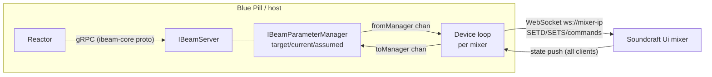

# IMPLEMENTATION.md — Design Notes & Protocol Reference

Agent/developer-oriented reference for building the Soundcraft Ui device core. Everything
here was extracted from the local clones in `reference/` (see README) during the research
phase on 2026-07-20. File citations point into `reference/` so they can be re-verified.

---

## 1. Architecture overview



Three layers, exactly mirroring `core-skaarhoj-template`:

1. **main.go** — CoreInfo branding, model registration, parameter registration, start
   manager + gRPC server (template default listen `:8502`; skaarOS production overrides to
   `/var/ibeam/sockets/<core>.socket` unless `IBEAM_CORE_ADDRESS` is set —
   `reference/ibeam-corelib-go/parameter-manager.go` ~L78).
2. **parameters.go** — parameter catalog (see §4).
3. **process.go** — one goroutine per configured device: WebSocket client, protocol
   codec, mixer state store, translation both directions.

Key corelib flow (verified in `reference/ibeam-corelib-go`):
- Reactor `Set` → `clientsSetterStream` → per-device queue → `ingestTargetParameter`
  (validates, sets target, marks assumed) → `processParameter` (controlDelay / retry) →
  `m.out` → **fromManager** channel → our device loop → wire message.
- Wire feedback → our device loop → **toManager** channel → `ingestCurrentParameter` →
  updates current, clears assumed (within `acceptanceThreshold` for floats) →
  `serverClientsStream` → Reactor Subscribe streams.
- Device connection status: send the auto-registered ConnectionState parameter
  (GenericType ConnectionState) from the device loop on connect/disconnect, as the template
  does in `process.go` ~L69/L89.

---

## 2. Soundcraft Ui WebSocket protocol (as reverse-engineered from soundcraft-ui)

Primary source: `reference/soundcraft-ui/packages/mixer-connection/src/lib/`, especially
`mixer-connection.ts`, `state/mixer-store.ts`, `facade/*.ts`, and the ground-truth
expected-string tests in `__tests__/outbound-messages.spec.ts`.

### 2.1 Transport

| Aspect | Value | Source |
|---|---|---|
| URL | `ws://<mixer-ip>` (no path, port 80) | mixer-connection.ts ~L85 |
| Outbound framing | prefix every logical message with `3:::` | mixer-connection.ts ~L87 |
| Inbound framing | accept only frames starting `3:::`, strip prefix; ignore `1::`, `2::` | mixer-connection.ts ~L161 |
| Batching | one frame may contain multiple lines, `\n`-separated — split and process each | mixer-connection.ts ~L170 |
| Keepalive | send literal `ALIVE` every **1000 ms** after open | mixer-connection.ts ~L26, L110 |
| Reconnect | on error, retry after **2000 ms**; manual reconnect = disconnect, wait 1 s, connect | mixer-connection.ts ~L23, L154, L230 |
| Handshake | none required; mixer pushes a full state dump on connect. soundcraft-ui waits heuristically (25 ms quiet or 250 ms cap) for "init done" | soundcraft-ui.ts ~L180, utils.ts ~L143 |

> The `3:::` / `1::` prefixes are Socket.IO-0.9-era framing remnants. **Verify on real
> hardware in milestone 2** — including whether a `/socket.io/1/websocket` path or HTTP
> handshake is needed (the library suggests not).

### 2.2 Message families

| Family | Syntax | Direction | Notes |
|---|---|---|---|
| Numeric set | `SETD^<path>^<number>` | both | bools are `0`/`1` |
| String set | `SETS^<path>^<string>` | both | value may itself contain `^` — parse path between first two `^` only, value = remainder |
| Command | `<CMD>[^arg[^arg…]]` | out | e.g. `RECTOGGLE`, `LOADSNAPSHOT^show^snap`, `MEDIA_PLAY` |
| List reply (flat) | `SHOWLIST^item^item…` | in | |
| List reply (keyed) | `SNAPSHOTLIST^<show>^item^item…` | in | empty = trailing `^` (`CUELIST^Default^`) |
| Sync | `BMSG^SYNC^<syncId>^<index>` | both | not needed for v1 |

### 2.3 Addressing

- Wire indices are **0-based**; user-facing numbering is 1-based (`i.2` = input **3**).
- Channel path templates (facade/channel-id.ts):
  - Master-mix channel: `{type}.{n}` → properties `.mute`, `.mix`, `.name`, `.mtkrec`, …
  - Send channel: `{type}.{n}.{aux|fx}.{bus}` → `.value`, `.mute`, `.post`
- Type letters (types.ts): `i` input, `l` line, `p` player, `f` fx, `s` sub, `a` aux,
  `v` vca, `m` master, `hw` preamp (Ui24R only).

### 2.4 v1 command/state matrix

| Function | Outbound | Feedback state key(s) |
|---|---|---|
| Mute input n | `SETD^i.<n-1>.mute^{0\|1}` | same path echoed + pushed on external change |
| Fader input n | `SETD^i.<n-1>.mix^<0.0–1.0>` | same path |
| Master fader | `SETD^m.mix^<0.0–1.0>` | same path |
| Load snapshot | `LOADSNAPSHOT^<show>^<snap>` | `SETS^var.currentShow^…`, `SETS^var.currentSnapshot^…` |
| List shows/snaps | `SHOWLIST`, then `SNAPSHOTLIST^<show>` per show | list replies (per-client, not in dump) |
| 2-track record | `RECTOGGLE` (toggle only!) | `var.isRecording` (0/1), `var.recBusy` (0/1) |
| Multitrack record (Ui24R) | `MTK_REC_TOGGLE` | `var.mtk.rec.currentState`, `var.mtk.rec.busy`, `var.mtk.rec.time` |
| Channel name (displays) | — | `SETS^i.<n-1>.name^<text>` |
| Model detect | — | state key `model` (e.g. `ui24`) |

### 2.5 Fader value semantics

Wire values are **linear 0.0–1.0** fader positions (not dB, not amplitude). soundcraft-ui
ships exact conversion code in
`packages/mixer-connection/src/lib/utils/value-converters/value-converters.ts`:

- Position → amplitude:
  $A(v)=\big(v<0.055 ? \sin(28.559933214452666\,v) : 1\big)\cdot e^{(23.90844819639692+(-26.23877598214595+(12.195249692570245-0.4878099877028098\,v)v)v)v}\cdot 2.676529517952372\times10^{-4}$
- Position → dB: $20\log_{10}A(v)$, rounded to 0.1 dB; $A(v)<10^{-10}\Rightarrow-\infty$.
- dB → position: Newton iteration on $A(v)=10^{db/20}$, clamped to $[0,1]$;
  $db\le-200\Rightarrow0$, $db\ge10\Rightarrow1$.

Port these to Go verbatim; generate reference vectors from the TS implementation for unit
tests (e.g. positions 0.0, 0.055, 0.1 … 1.0 and dB −80, −40, −20, −10, 0, +10).

For v1 the core can expose the raw 0.0–1.0 float to Reactor (Floating parameter) and use
the dB conversion only for display labels; a dB-calibrated parameter variant is a stretch.

### 2.6 Model differences (device-capabilities.ts)

| | Ui12 | Ui16 | Ui24R |
|---|---|---|---|
| inputs `i` | 8 | 12 | 24 |
| line `l` | 2 | 2 | 2 |
| player `p` | 2 | 2 | 2 |
| fx `f` | 4 | 4 | 4 |
| sub `s` | 4 | 4 | 6 |
| aux `a` | 4 | 6 | 10 |
| vca `v` | 0 | 0 | 6 |
| multitrack | no | no | yes |
| preamp path | `i.<n>.gain` | `i.<n>.gain` | `hw.<n>.gain` |

### 2.7 Feedback behavior (critical design fact)

The mixer pushes every state change to **all** connected WebSocket clients, including the
echo of our own writes. There is no subscribe step. Consequences:

- Feedback for external changes is free: just reduce all inbound `SETD`/`SETS` into the
  store and forward mapped keys to `toManager`.
- Our own writes come back as echoes → they conveniently confirm the target and clear
  assumed-state through the normal `ingestCurrentParameter` path. Use
  `acceptanceThreshold` on floats to avoid flapping on rounding.
- Loop-storm risk: do **not** re-send to the mixer in response to inbound messages; only
  `fromManager` traffic goes out. The corelib's target/current model handles the rest.

---

## 3. IBeam framework facts (from ibeam-corelib-go / ibeam-core-proto)

- Proto version `v0.3.17` (`ibeam-core.proto` option). Corelib module
  `github.com/SKAARHOJ/ibeam-corelib-go` v0.4.41, Go 1.25 (template go.mod).
- Constructors: `CreateServerWithConfig` loads TOML config, exposes schema via gRPC
  (`GetCoreConfigSchema` / `GetCoreConfig` / `SetCoreConfig`). Config location:
  `/var/ibeam/config` on skaarOS, `<coreName>-storage` elsewhere, `IBEAM_CONFIG_DIR`
  override (`ibeam-lib-config/config.go` ~L24-L63).
- `RegisterModel` per mixer model; `RegisterParameterForModels` for model-specific
  parameters (multitrack → Ui24R only). Devices from config registered via
  `RegisterDeviceWithModelName`.
- Connection state: a `connection` parameter (`GenericType_ConnectionState`) is
  auto-added with ID 1 if not registered; the template registers it explicitly (Binary,
  NoControl-style, fed via `toManager` on connect/disconnect). When a connection-state
  parameter exists, Reactor blocks control of all other parameters while disconnected
  unless they set `controllableWhileDisconnected` — we leave that unset, so outputs are
  automatically indicated/greyed while the mixer is powered off.
- ParameterDetail fields we will use: `ControlStyle` (Normal / Oneshot / NoControl),
  `FeedbackStyle` (NormalFeedback / NoFeedback), `ValueType` (Binary, Floating, Opt,
  String, NoValue), `minimum`/`maximum`, `acceptanceThreshold`, `optionList` +
  `optionListIsDynamic`, `retryCount`, `controlDelayMs`, `dimensions` +
  `DimensionDetail.elementLabels` (channel strips), `displaySuffix`,
  `displayFloatPrecision`, `RecommendedParamForTextDisplay`, `GenericType`.
- Parameter class templates (from template `parameters.go` + proto):
  - **Trigger** (snapshot up/down): ValueType NoValue, ControlStyle
    Oneshot, FeedbackStyle NoFeedback; payload helper `Trigger()`.
  - **Toggle w/ feedback** (mute, record): ValueType Binary, ControlStyle Normal,
    NormalFeedback.
  - **Fader**: ValueType Floating, min 0 max 1, ControlStyle Normal, NormalFeedback,
    acceptanceThreshold ~0.001, fine/coarse steps.
  - **Read-only display** (current snapshot name, rec time): ControlStyle NoControl,
    ValueType String, `RecommendedParamForTextDisplay`.
    (Dynamic Opt lists exist in the framework — `optionListIsDynamic` +
    `optionListUpdate` — but are not used in v1 per the snapshot-UX decision.)
- Dimensions: register mute/fader once with a channel dimension sized per model, using
  `elementLabels` for default channel names. Consider live label updates from
  `i.<n>.name` (verify corelib support for dynamic element labels — TBD).
- `ModelInfo.DeviceWebUILink` supports `http://{ip}/` for an "Open UI" button in Reactor.

---

## 4. Proposed parameter catalog (post-G0)

| # | Name | Type / Style | Dimension | Wire mapping |
|---|---|---|---|---|
| 1 | `connection` | Binary, GenericType ConnectionState | device | WS connect/disconnect state |
| 2 | `channel_mute` | Binary, Normal, feedback | channel (model-sized: inputs + line) | `{i\|l}.<n>.mute` |
| 3 | `channel_fader` | Floating 0–1, Normal, feedback | channel (same) | `{i\|l}.<n>.mix` |
| 4 | `master_fader` | Floating 0–1, Normal, feedback | — | `m.mix` (no master mute path exists; `m.dim` out of scope) |
| 5 | `snapshot_up` | NoValue, Oneshot | — | `LOADSNAPSHOT^show^<next snap in cached list>` |
| 6 | `snapshot_down` | NoValue, Oneshot | — | `LOADSNAPSHOT^show^<prev snap in cached list>` |
| 7 | `current_snapshot` | String, NoControl | — | `var.currentShow` + `var.currentSnapshot` |
| 8 | `record_2track` | Binary, Normal, feedback (toggle) | — | `RECTOGGLE` sent when target ≠ `var.isRecording` |
| 9 | `record_busy` | Binary, NoControl | — | `var.recBusy` |
| 10 | `record_multitrack` (Ui24R) | as #8 | — | `MTK_REC_TOGGLE` / `var.mtk.rec.*` |
| 11 | `channel_name` | String, NoControl | channel | `{i\|l}.<n>.name` |

Channel dimension flattening: single 1-based dimension ordered `inputs, line` with labels
like `IN 1…`, `LINE 1…`; per-model sizes from §2.6. Player/FX/sub/aux/VCA masters and
per-bus sends are deferred past v1 (G0 decision 2026-07-20).

Snapshot up/down semantics: the core caches `SNAPSHOTLIST` for the current show, locates
`var.currentSnapshot` in that list, and loads the adjacent entry (wrapping at the ends).
If the list is empty or the current snapshot is unknown, the trigger is a logged no-op.

---

## 5. Device loop design (process.go plan)

```
per device goroutine (runs for the life of the service):
  loop:
    dial ws://<ip> (no TLS; LAN only)          — retry forever w/ 2 s backoff
    on open: send ALIVE ticker (1 s); send SHOWLIST; connection=1
    select:
      inbound frame  -> reset read deadline; strip "3:::", split "\n" ->
                        SETD/SETS -> store.set(path, val); if mapped -> toManager
                        SHOWLIST/SNAPSHOTLIST -> update snapshot list cache
      fromManager    -> map parameter -> wire msg -> send "3:::"+msg
      read deadline hit / disconnect
                     -> connection=0; stop ticker; clear store + snapshot cache; retry
```

### Mixer power-cycling is normal operation

In the target installation the SKAARHOJ controller switches mains power to the mixer
while the QuickBar — and therefore this core — stays up. The mixer disappearing and
reappearing is **routine**, not an error condition:

- **Reconnect forever.** The per-device loop never exits; 2 s backoff between attempts.
  Log the transition once per state change (connected ↔ disconnected), not per retry
  attempt, to avoid log spam during long power-off periods.
- **Dead-link detection.** A power cut usually produces no TCP FIN, so a blocked read
  can hang indefinitely. Use a read deadline (~5 s): the mixer chatters continuously
  (state/VU traffic), so silence means the link is dead — drop and redial. (`ALIVE` is
  client→mixer only; confirm the idle-traffic assumption in milestone 2.)
- **On disconnect:** set `connection`=0 — Reactor indicates the state and blocks the
  other parameters (none set `controllableWhileDisconnected`). Clear the in-memory
  store and snapshot cache so no stale state is served or used for gating; the record
  toggle and snapshot up/down become logged no-ops while disconnected.
- **While disconnected:** discard `fromManager` writes (debug log). Do **not** queue
  commands for replay at power-on — a stale unmute or `RECTOGGLE` firing when the mixer
  comes back would be surprising and potentially harmful.
- **On reconnect:** the mixer pushes a full initial state dump, so current values resync
  through the normal ingest path for free; re-request `SHOWLIST` / `SNAPSHOTLIST` to
  rebuild the snapshot cache.

- Store: `map[string]string` + typed getters; keep raw dump so future parameters need no
  protocol changes.
- Outbound writes must be serialized (single writer goroutine); WS libs are not
  concurrent-write-safe.
- Recording toggle: symmetric gate — on target ≠ `var.isRecording` → send `RECTOGGLE`
  (covers both start and stop); rely on state echo to confirm and drive the button
  display. Race window accepted (G0 decision 2026-07-20; matches the mixer's own web UI).
- `var.recBusy` semantics are **unverified**: presumed a transient flag while the
  recorder opens/finalizes the file on the USB stick (soundcraft-ui exposes it but never
  gates control on it). We tentatively suppress sends while `recBusy`=1 to guard against
  retry double-fire: if `isRecording` lags during the start/stop transition, a corelib
  retry (`retryCount`) would fire a second `RECTOGGLE` and undo the first. Milestone 2
  observes `recBusy` timing; if it doesn't cover the transition window, drop the
  suppression and tune `controlDelayMs`/retry instead.

## 6. Testing strategy

- **Unit (no mixer):** codec (frame/parse), path builders vs. exact strings from
  `outbound-messages.spec.ts` (e.g. `SETD^i.2.mute^1`, `SETD^i.2.mix^0.4`,
  `LOADSNAPSHOT^show^snap`), dB conversion vectors, list-reply parser, record gating.
- **Mock mixer:** tiny WS server replaying a captured init dump for integration tests of
  the full loop without hardware; also simulates power-cycles (abrupt close and silent
  hang without FIN) to exercise reconnect and dead-link detection. Capture a real dump
  in milestone 2 and store it under `testdata/` (own capture = no license concern).
- **Hardware/demo:** Soundcraft offers an offline demo of the Ui24R web UI
  (`http://uiremoteapp.soundcraft.com` historically); whether it speaks WS is unverified —
  probe in milestone 2. Real hardware is the gate authority.

## 7. Open questions (feed TODO §0)

1. **Licensing** — RESOLVED, see Decision log entry 2026-07-20. Residual accepted risk:
   `ibeam-corelib-go` & `ibeam-core-proto` have no LICENSE file (implied license via
   publication-for-consumption); mitigate with source-only releases; optionally request a
   LICENSE from SKAARHOJ.
2. **Packaging for on-device install** — RESOLVED approach, see §8. We build the core
   as a standard `.ipks` and install it through the system-manager local-upload endpoint
   (`POST /api/install-custom-package`). If a signed package turns out to be required, we
   coordinate with SKAARHOJ on the supported way to publish/sign a third-party core.
   `skaarOS-cli` availability is a nice-to-have, not a blocker.
3. **Blue Pill CPU architecture** — RESOLVED: **arm64** (sample package control file
   `Architecture: arm64`; ELF machine 0xB7/AArch64; static Go 1.25.6 binary).
4. **Socket.IO framing on current firmware** — `3:::` prefix and pathless `ws://ip` derive
   from soundcraft-ui (actively maintained, so likely correct); still verify against our
   firmware version in milestone 2, including behavior differences Ui16 vs Ui24R.
5. **`RECTOGGLE`-only recording control** — RESOLVED, see Decision log entry 2026-07-20:
   single toggle with state feedback; race window accepted.
6. **Snapshot selection UX** — RESOLVED, see Decision log entry 2026-07-20: up/down
   stepping within the current show + current-snapshot-name display.
7. **Dynamic element labels** — can channel `elementLabels` update at runtime from
   `i.<n>.name`? Needs corelib verification; fallback = static labels + `channel_name`
   parameter for displays.
8. **Fader parameter unit** — expose linear 0–1 (simple, matches motorized fader hardware)
   vs. dB-calibrated float. v1 proposal: linear + dB display suffix.

## 8. skaarOS package format (`.ipks`) — reverse-engineered 2026-07-20

Source: `reference/ipks-sample/core-bmd-webpresenter.1.0.0.arm64.ipks` (official SKAARHOJ
package, provided by project owner). Naming: `<core>.<version>.<arch>.ipks`.

### Container layout

```
offset 0x00  63-byte outer header (SKAARHOJ packaging envelope):
             0x00: magic 90 0d 03 00
             0x04: 2 bytes (0a 01 in sample — version fields?)
             0x06: 8 bytes (SKAARHOJ-internal)
             0x0e: remaining header bytes (SKAARHOJ-internal)
             ....: inner filename, ASCII: "core-bmd-webpresenter.1.0.0.arm64.ipki"
                   (the inner `.ipki` = the plain opkg/ipk before the envelope is added)
             ....: trailing header bytes
offset 0x3F  gzip stream → decompresses to a TAR (ustar) containing:
             ├─ debian-binary        "2.0"          (classic opkg/ipk marker)
             ├─ control.tar.gz       package metadata + maintainer scripts
             └─ data.tar.gz          installed filesystem tree
```

So apart from the outer header it is a **standard tar-based opkg/ipk package**.

### control.tar.gz contents (sample values)

- `control`:
  `Package: core-bmd-webpresenter`, `Version: 1.0.0`, `Architecture: arm64`,
  `Maintainer: info@skaarhoj.com`, `Description: …`, `Priority: optional`,
  `Depends: skaaros-version (>= 0.9)`, `Tags: L_CONTROLLER DS_released`
  (tags plausibly map to Reactor category + maturity/development status).
- `changes` — markdown changelog.
- `conffiles` — lists `/service/pkg/<core>/down`.
- `preinst` — `mkdir -p /var/ibeam/{log,env,config}/<core>`; `sv stop` if running.
- `postinst` / `prerm` — runit service start/stop; prerm removes
  `/var/ibeam/env/<core>`, `/var/ibeam/socket/<core>.socket` (note singular `socket` here
  vs `sockets` in corelib source — verify at packaging time), `/service/pkg/<core>`.
- All scripts stamped `# Generated by skaarOS-cli v0.2.4 (df250cf)` — a SKAARHOJ CLI tool
  not found in public repos.

### data.tar.gz contents

```
/usr/bin/<core>                statically linked Go ELF (arm64, buildmode=exe)
/service/pkg/<core>/run        #!/bin/sh; exec envdir /var/ibeam/env/<core> /usr/bin/<core>
/service/pkg/<core>/log/run    exec svlogd -tt /var/ibeam/log/<core>
/service/pkg/<core>/down       empty (runit: don't autostart until told)
```

i.e. skaarOS uses **runit** supervision; env injected via `envdir`; logs via `svlogd`.

### Sample binary build info (via `go version -m`)

Go **1.25.6**, module `core-bmd-webpresenter v1.0.0`, key deps:
`ibeam-corelib-go v0.4.37`, `ibeam-lib-config v0.2.24`, `ibeam-lib-env v0.1.1`,
`ibeam-lib-licensing v0.2.1` (JWT-based — official cores embed license enforcement; ours
needs none), **`gorilla/websocket v1.5.3`**, `BurntSushi/toml`, `sirupsen/logrus`,
`s00500/env_logger`, `jpillora/backoff`, grpc v1.78.0 / protobuf v1.36.11.

### Implications for us

- Build target: `GOOS=linux GOARCH=arm64 CGO_ENABLED=0`.
- Produce the installable artifact as a **standard opkg/ipk** (`debian-binary` +
  `control.tar.gz` + `data.tar.gz`) laid out exactly like the sample: the arm64 core
  binary at `/usr/bin/<core>` plus the runit service tree under `/service/pkg/<core>`.
- **Working assumption:** dropping that `.ipks` into the system-manager local-upload page
  (`POST /api/install-custom-package`) installs and supervises the core. Milestone 7
  validates this on real hardware. If the local upload rejects a package we built
  ourselves, we pause and work with SKAARHOJ to identify the supported path for
  publishing a third-party core.

## 9. Protocol validation results (milestone 2 — to be filled)

| Check | Result | Evidence |
|---|---|---|
| _pending — see TODO §2_ | | |

## 10. Decision log

Format: `DECISION: <date> — <topic> — <decision> — <rationale>`

- DECISION: 2026-07-20 — Licensing — Repo stays BSD-3-Clause for our original code;
  distribution is free-of-charge source (no selling); any code adapted near-verbatim from
  core-skaarhoj-template retains Apache-2.0 + Commons Clause attribution (preference:
  implement from spec, don't copy); binaries embedding unlicensed SKAARHOJ libs are a
  known, accepted implied-license risk — prefer source-only releases. — Owner intends
  free availability, not sale; Commons Clause only restricts selling; go.mod deps are
  user-fetched, not redistributed.
- DECISION: 2026-07-20 — WebSocket library — Use gorilla/websocket. — Mature, pure Go,
  static-build friendly, de-facto standard.
- DECISION: 2026-07-20 — Test hardware / model support — Integration-test against the
  Ui16 (hardware on hand); register all three models (Ui12, Ui16, Ui24R) with per-model
  channel counts so other users can use the core; Ui24R-only features (multitrack) are
  implemented from spec and flagged as untested on hardware. — Only a Ui16 is available,
  but supporting the full family costs little beyond model registration.
- DECISION: 2026-07-20 — Snapshot UX — Up/down (previous/next) snapshot stepping within
  the current show via Oneshot triggers, plus a read-only current-snapshot-name string
  parameter for displays; no dynamic option-list parameter in v1. — Covers the panel use
  case (step + see where you are) without the complexity of dynamic option lists.
- DECISION: 2026-07-20 — Recording control — Single toggle parameter (Binary, Normal,
  NormalFeedback): send `RECTOGGLE` when target differs from `var.isRecording`, suppress
  while `var.recBusy`=1; the button displays the actual recording state; the inherent
  race window is accepted. — Matches the mixer's own web UI behavior; discrete
  start/stop cannot be made race-free over a toggle-only wire command anyway.
- DECISION: 2026-07-20 — Channel dimension scope (v1) — Master-mix mute + fader for
  input (`i`) and line-in (`l`) channels plus the master fader (`m.mix`); no
  master-mute parameter (the mixer exposes no master mute path, only `m.dim`);
  player/FX/sub/aux/VCA masters and per-bus sends deferred. — Covers the owner's Ui16
  use case (all input strips + line-in + master) while keeping the v1 dimension simple.
- DECISION: 2026-07-20 — Mixer power-cycling / disconnect handling — The SKAARHOJ
  switches mixer power while the core keeps running, so disconnects are routine: the
  core reconnects forever (2 s backoff, read-deadline dead-link detection), clears the
  state store and snapshot cache on disconnect, discards writes while disconnected (no
  replay queue), and resyncs from the fresh initial dump on reconnect. The `connection`
  parameter (GenericType ConnectionState) indicates the state in Reactor and blocks the
  other parameters (`controllableWhileDisconnected` left unset). — Replaying queued
  commands at power-on is surprising and potentially harmful; the mixer's full init dump
  makes resync free.
- DECISION: 2026-07-20 — On-device deployment — Build the core as a standard `.ipks` and
  install it via the system-manager local-upload page
  (`POST /api/install-custom-package`); it lands as a supervised runit service under
  `/service/pkg/<core>` with the binary at `/usr/bin/<core>`. If a self-built package is
  not accepted, coordinate with SKAARHOJ on the supported path for a third-party core. —
  Owner requires everything to run on the Blue Pill; local upload is the documented
  install path and needs no external host.
- DECISION: 2026-07-20 — Target architecture — linux/arm64, CGO_ENABLED=0. — Confirmed by
  sample package Architecture field and ELF header.
