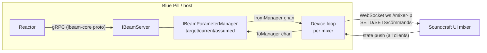

# IMPLEMENTATION.md — Design Notes & Protocol Reference

Agent/developer-oriented reference for building the Soundcraft Ui device core. Everything
here was extracted from the local clones in `reference/` (see README) during the research
phase on 2026-07-20. File citations point into `reference/` so they can be re-verified.

---

## 1. Architecture overview



Three layers, exactly mirroring `core-skaarhoj-template`:

1. **main.go** — CoreInfo branding, model registration, parameter registration, start
   manager + gRPC server (template default listen `:8502`; skaarOS production overrides to
   `/var/ibeam/sockets/<core>.socket` unless `IBEAM_CORE_ADDRESS` is set —
   `reference/ibeam-corelib-go/parameter-manager.go` ~L78).
2. **parameters.go** — parameter catalog (see §4).
3. **process.go** — one goroutine per configured device: WebSocket client, protocol
   codec, mixer state store, translation both directions.

Key corelib flow (verified in `reference/ibeam-corelib-go`):
- Reactor `Set` → `clientsSetterStream` → per-device queue → `ingestTargetParameter`
  (validates, sets target, marks assumed) → `processParameter` (controlDelay / retry) →
  `m.out` → **fromManager** channel → our device loop → wire message.
- Wire feedback → our device loop → **toManager** channel → `ingestCurrentParameter` →
  updates current, clears assumed (within `acceptanceThreshold` for floats) →
  `serverClientsStream` → Reactor Subscribe streams.
- Device connection status: send the auto-registered ConnectionState parameter
  (GenericType ConnectionState) from the device loop on connect/disconnect, as the template
  does in `process.go` ~L69/L89.

---

## 2. Soundcraft Ui WebSocket protocol (as reverse-engineered from soundcraft-ui)

Primary source: `reference/soundcraft-ui/packages/mixer-connection/src/lib/`, especially
`mixer-connection.ts`, `state/mixer-store.ts`, `facade/*.ts`, and the ground-truth
expected-string tests in `__tests__/outbound-messages.spec.ts`.

### 2.1 Transport

| Aspect | Value | Source |
|---|---|---|
| URL | `ws://<mixer-ip>` (no path, port 80) | mixer-connection.ts ~L85 |
| Outbound framing | prefix every logical message with `3:::` | mixer-connection.ts ~L87 |
| Inbound framing | accept only frames starting `3:::`, strip prefix; ignore `1::`, `2::` | mixer-connection.ts ~L161 |
| Batching | one frame may contain multiple lines, `\n`-separated — split and process each | mixer-connection.ts ~L170 |
| Keepalive | send literal `ALIVE` every **1000 ms** after open | mixer-connection.ts ~L26, L110 |
| Reconnect | on error, retry after **2000 ms**; manual reconnect = disconnect, wait 1 s, connect | mixer-connection.ts ~L23, L154, L230 |
| Handshake | none required; mixer pushes a full state dump on connect. soundcraft-ui waits heuristically (25 ms quiet or 250 ms cap) for "init done" | soundcraft-ui.ts ~L180, utils.ts ~L143 |

> The `3:::` / `1::` prefixes are Socket.IO-0.9-era framing remnants. **Verified on a Ui16
> (firmware 1.0.7548-ui16) 2026-08-23** — the whole table holds. No HTTP handshake is
> needed; the `/socket.io/1/websocket/<sid>` path also works but buys nothing. The mixer
> closes a client that sends nothing after ~19 s, so the keepalive is mandatory, not
> optional. Details and message excerpts in §9.

### 2.2 Message families

| Family | Syntax | Direction | Notes |
|---|---|---|---|
| Numeric set | `SETD^<path>^<number>` | both | bools are `0`/`1` |
| String set | `SETS^<path>^<string>` | both | value may itself contain `^` — parse path between first two `^` only, value = remainder |
| Command | `<CMD>[^arg[^arg…]]` | out | e.g. `RECTOGGLE`, `LOADSNAPSHOT^show^snap`, `MEDIA_PLAY` |
| List reply (flat) | `SHOWLIST^item^item…` | in | |
| List reply (keyed) | `SNAPSHOTLIST^<show>^item^item…` | in | empty = trailing `^` (`SNAPSHOTLIST^2023-10-19^`); unknown show returns the same empty form. `CUELIST` gets no reply at all on Ui16 firmware 1.0.7548 |
| Sync | `BMSG^SYNC^<syncId>^<index>` | both | not needed for v1 |

### 2.3 Addressing

- Wire indices are **0-based**; user-facing numbering is 1-based (`i.2` = input **3**).
- Channel path templates (facade/channel-id.ts):
  - Master-mix channel: `{type}.{n}` → properties `.mute`, `.mix`, `.name`, `.mtkrec`, …
  - Send channel: `{type}.{n}.{aux|fx}.{bus}` → `.value`, `.mute`, `.post`
- Type letters (types.ts): `i` input, `l` line, `p` player, `f` fx, `s` sub, `a` aux,
  `v` vca, `m` master, `hw` preamp (Ui24R only).

### 2.4 v1 command/state matrix

| Function | Outbound | Feedback state key(s) |
|---|---|---|
| Mute input n | `SETD^i.<n-1>.mute^{0\|1}` | same path echoed + pushed on external change |
| Fader input n | `SETD^i.<n-1>.mix^<0.0–1.0>` | same path |
| Master fader | `SETD^m.mix^<0.0–1.0>` | same path |
| Load snapshot | `LOADSNAPSHOT^<show>^<snap>` | `SETS^var.currentShow^…`, `SETS^var.currentSnapshot^…` |
| List shows/snaps | `SHOWLIST`, then `SNAPSHOTLIST^<show>` per show | list replies (per-client, not in dump) |
| 2-track record | `RECTOGGLE` (toggle only!) | `var.isRecording` (0/1), `var.recBusy` (0/1) |
| Multitrack record (Ui24R) | `MTK_REC_TOGGLE` | `var.mtk.rec.currentState`, `var.mtk.rec.busy`, `var.mtk.rec.time` |
| Channel name (displays) | — | `SETS^i.<n-1>.name^<text>` |
| Model detect | — | state key `model` (e.g. `ui24`) |

### 2.5 Fader value semantics

Wire values are **linear 0.0–1.0** fader positions (not dB, not amplitude). soundcraft-ui
ships exact conversion code in
`packages/mixer-connection/src/lib/utils/value-converters/value-converters.ts`:

- Position → amplitude:
  $A(v)=\big(v<0.055 ? \sin(28.559933214452666\,v) : 1\big)\cdot e^{(23.90844819639692+(-26.23877598214595+(12.195249692570245-0.4878099877028098\,v)v)v)v}\cdot 2.676529517952372\times10^{-4}$
- Position → dB: $20\log_{10}A(v)$, rounded to 0.1 dB; $A(v)<10^{-10}\Rightarrow-\infty$.
- dB → position: Newton iteration on $A(v)=10^{db/20}$, clamped to $[0,1]$;
  $db\le-200\Rightarrow0$, $db\ge10\Rightarrow1$.

Port these to Go verbatim; generate reference vectors from the TS implementation for unit
tests (e.g. positions 0.0, 0.055, 0.1 … 1.0 and dB −80, −40, −20, −10, 0, +10).

The fader parameters present a 0–100 linear-tick float to Reactor and pair with a read-only
String companion carrying the dB reading (Decision log "Fader 0–100 scale and paired dB
display"). The wire stays linear 0.0–1.0 (value/100).

### 2.6 Model differences (device-capabilities.ts)

| | Ui12 | Ui16 | Ui24R |
|---|---|---|---|
| inputs `i` | 8 | 12 | 24 |
| line `l` | 2 | 2 | 2 |
| player `p` | 2 | 2 | 2 |
| fx `f` | 4 | 4 | 4 |
| sub `s` | 4 | 4 | 6 |
| aux `a` | 4 | 6 | 10 |
| vca `v` | 0 | 0 | 6 |
| multitrack | no | no | yes |
| preamp path | `i.<n>.gain` | `i.<n>.gain` | `hw.<n>.gain` |

### 2.7 Feedback behavior (critical design fact)

Verified on hardware 2026-08-23 (§9). The mixer pushes state changes to every connected
WebSocket client **except the one that caused the change**, and only when the value
actually changes. There is no subscribe step. Three rules:

1. **No self-echo on writes.** A client that sends `SETD^<path>^<v>` never receives that
   `SETD` back. Other clients do, within 41–75 ms.
2. **No push when nothing changes.** Writing a path's current value is silent to everyone.
3. **Mixer-generated changes reach everyone, sender included.** The mixer delivers state it
   computes itself to the sender too. That covers `var.isRecording` after `RECTOGGLE`, and
   `var.currentSnapshot` plus the ~140 keys after `LOADSNAPSHOT`. Rule 1 suppresses only
   the exact message the sender wrote.

Consequences:

- Feedback for external changes costs nothing. Reduce all inbound `SETD`/`SETS` into the
  store and forward mapped keys to `toManager`.
- **Our own writes are never confirmed by the mixer.** Rules 1 and 2 mean a write can
  produce no wire traffic at all. So waiting for an echo never clears assumed-state. The
  core confirms optimistically instead: after sending, ingest the sent value as current
  (see Decision log 2026-08-23). Use `acceptanceThreshold` on floats anyway, because other
  clients' float pushes still arrive at ~9 decimal places.
- Rule 1 also removes the feedback-loop risk for our own traffic. Still do **not** re-send
  to the mixer in response to inbound messages; only `fromManager` traffic goes out.

---

## 3. IBeam framework facts (from ibeam-corelib-go / ibeam-core-proto)

- Proto version `v0.3.17` (`ibeam-core.proto` option). Corelib module
  `github.com/SKAARHOJ/ibeam-corelib-go` v0.4.41, Go 1.25 (template go.mod).
- Constructors: `CreateServerWithConfig` loads TOML config, exposes schema via gRPC
  (`GetCoreConfigSchema` / `GetCoreConfig` / `SetCoreConfig`). Config location:
  `/var/ibeam/config` on skaarOS, `<coreName>-storage` elsewhere, `IBEAM_CONFIG_DIR`
  override (`ibeam-lib-config/config.go` ~L24-L63).
- `RegisterModel` per mixer model; `RegisterParameterForModels` for model-specific
  parameters (multitrack → Ui24R only). Devices from config registered via
  `RegisterDevice(deviceID, modelID)` with the ModelID from `BaseDeviceConfig`.
  Do **not** use `RegisterDeviceWithModelName`: in corelib v0.4.41 it finds the model by
  name but never assigns the found ID, so it always registers model 0 (generic)
  (`parameter-registry.go` ~L562, found 2026-08-23).
- Connection state: a `connection` parameter (`GenericType_ConnectionState`) is
  auto-added with ID 1 if not registered; the template registers it explicitly (Binary,
  NoControl-style, fed via `toManager` on connect/disconnect). When a connection-state
  parameter exists, Reactor blocks control of all other parameters while disconnected
  unless they set `controllableWhileDisconnected` — we leave that unset, so outputs are
  automatically indicated/greyed while the mixer is powered off.
- ParameterDetail fields we will use: `ControlStyle` (Normal / Oneshot / NoControl),
  `FeedbackStyle` (NormalFeedback / NoFeedback), `ValueType` (Binary, Floating, Opt,
  String, NoValue), `minimum`/`maximum`, `acceptanceThreshold`, `optionList` +
  `optionListIsDynamic`, `retryCount`, `controlDelayMs`, `dimensions` +
  `DimensionDetail.elementLabels` (channel strips), `displaySuffix`,
  `displayFloatPrecision`, `RecommendedParamForTextDisplay`, `GenericType`.
- Parameter class templates (from template `parameters.go` + proto):
  - **Trigger** (snapshot up/down): ValueType NoValue, ControlStyle
    Oneshot, FeedbackStyle NoFeedback; payload helper `Trigger()`.
  - **Toggle w/ feedback** (mute, record): ValueType Binary, ControlStyle Normal,
    NormalFeedback.
  - **Fader**: ValueType Floating, min 0 max 100 (linear tick), ControlStyle Normal,
    NormalFeedback, acceptanceThreshold 0.1, fine/coarse steps, paired dB display companion.
  - **Read-only display** (current snapshot name, rec time): ControlStyle NoControl,
    ValueType String, `RecommendedParamForTextDisplay`.
    (The framework does offer dynamic Opt lists, via `optionListIsDynamic` and
    `optionListUpdate`. v1 does not use them, per the snapshot-UX decision.)
- Dimensions: register mute/fader once with a channel dimension sized per model, using
  `elementLabels` for default channel names. `elementLabels` cannot update at runtime and
  are model-scoped, so live channel names ship as the `channel_name` parameter instead
  (Decision log 2026-08-24, open question 7).
- `ModelInfo.DeviceWebUILink` supports `http://{ip}/` for an "Open UI" button in Reactor.

---

## 4. Proposed parameter catalog (post-G0)

| # | Name | Type / Style | Dimension | Wire mapping |
|---|---|---|---|---|
| 1 | `connection` | Binary, GenericType ConnectionState | device | WS connect/disconnect state |
| 2 | `channel_mute` | Binary, Normal, feedback | channel (model-sized: inputs + line) | `{i\|l}.<n>.mute` |
| 3 | `channel_fader` | Floating 0–100 (linear tick), Normal, feedback | channel (same) | `{i\|l}.<n>.mix` (wire linear 0.0–1.0 = value/100) |
| 3a | `channel_fader_db` | String, NoControl, feedback | channel (same) | dB reading of `channel_fader` (display companion) |
| 4 | `master_fader` | Floating 0–100 (linear tick), Normal, feedback | — | `m.mix` (wire = value/100; no master mute path; `m.dim` out of scope) |
| 4a | `master_fader_db` | String, NoControl, feedback | — | dB reading of `master_fader` (display companion) |
| 5 | `snapshot_up` | NoValue, Oneshot | — | `LOADSNAPSHOT^show^<next snap in cached list>` |
| 6 | `snapshot_down` | NoValue, Oneshot | — | `LOADSNAPSHOT^show^<prev snap in cached list>` |
| 7 | `current_snapshot` | String, NoControl | — | `var.currentShow` + `var.currentSnapshot` |
| 8 | `record_2track` | Binary, Normal, feedback (toggle) | — | `RECTOGGLE` sent when target ≠ `var.isRecording` |
| 9 | `record_busy` | Binary, NoControl | — | `var.recBusy` |
| 10 | `record_multitrack` (Ui24R) | as #8 | — | `MTK_REC_TOGGLE` sent when target ≠ `var.mtk.rec.currentState` |
| 10a | `multitrack_busy` (Ui24R) | Binary, NoControl | — | `var.mtk.rec.busy` |
| 10b | `multitrack_time` (Ui24R) | String, NoControl | — | `var.mtk.rec.time` |
| 11 | `channel_name` | String, NoControl, feedback | channel (same as `channel_mute`) | `{i\|l}.<n>.name` (SETS only); `channel_mute`/`channel_fader`/`channel_fader_db` point their `RecommendedParamForTitleDisplay` at it |

Channel dimension flattening: single 1-based dimension ordered `inputs, line` with labels
like `IN 1…`, `LINE 1…`; per-model sizes from §2.6. Player/FX/sub/aux/VCA masters and
per-bus sends are deferred past v1 (G0 decision 2026-07-20).

Snapshot up/down semantics: the core caches `SNAPSHOTLIST` for the current show, locates
`var.currentSnapshot` in that list, and loads the adjacent entry (wrapping at the ends).
If the list is empty or the current snapshot is unknown, the trigger is a logged no-op.
Stepping reads the mixer-confirmed `var.currentSnapshot`, so presses that land inside the
mixer's ~220 ms load-confirm window compute the same target and collapse to one step —
the step count follows the mixer's actual position, never an assumed one.

---

## 5. Device loop design (process.go plan)

```
per device goroutine (runs for the life of the service):
  loop:
    dial ws://<ip> (no TLS; LAN only)          — retry forever w/ 2 s backoff
    on open: send ALIVE ticker (1 s); send SHOWLIST; connection=1
    select:
      inbound frame  -> reset read deadline; strip "3:::", split "\n" ->
                        SETD/SETS -> store.set(path, val); if mapped -> toManager
                        SHOWLIST/SNAPSHOTLIST -> update snapshot list cache
      fromManager    -> map parameter -> clamp -> wire msg -> send "3:::"+msg
                        -> immediately ingest sent value as current (no echo arrives)
      read deadline hit / disconnect
                     -> connection=0; stop ticker; clear store + snapshot cache; retry
```

### Mixer power-cycling is normal operation

In the target installation the SKAARHOJ controller switches mains power to the mixer. The
QuickBar stays up throughout, and so does this core. The mixer disappearing and
reappearing is **routine**, not an error condition:

- **Reconnect forever.** The per-device loop never exits; 2 s backoff between attempts.
  Log the transition once per state change (connected ↔ disconnected), not per retry
  attempt, to avoid log spam during long power-off periods.
- **Dead-link detection.** A power cut produces no TCP FIN, so a blocked read can hang
  indefinitely. Use a read deadline of ~5 s. The mixer chatters continuously: measured
  `RTA` ~27 Hz, `VU2` ~6 Hz, `2::` ~13 Hz, worst observed gap 2.65 s. Silence therefore
  means the link is dead, so drop and redial. (`ALIVE` is client→mixer only.) Idle traffic
  was confirmed 2026-08-23. Real power cuts were measured 2026-08-24 and are exactly the
  silent case: the socket stays `ESTABLISHED` with no FIN or RST, and the deadline detects
  the loss in 5.15–5.21 s (§9.6).
- **On disconnect:** set `connection`=0. Reactor then indicates the state and blocks the
  other parameters (none set `controllableWhileDisconnected`). Clear the in-memory store
  and snapshot cache so no stale state is served or used for gating. The record toggle and
  snapshot up/down become logged no-ops while disconnected.
- **While disconnected:** discard `fromManager` writes (debug log). Do **not** queue
  commands for replay at power-on. A stale unmute or `RECTOGGLE` firing when the mixer
  comes back would be surprising and potentially harmful.
- **On reconnect:** the mixer pushes a full initial state dump. Current values therefore
  resync through the normal ingest path for free. Re-request `SHOWLIST` / `SNAPSHOTLIST`
  to rebuild the snapshot cache.

- Store: `map[string]string` + typed getters; keep raw dump so future parameters need no
  protocol changes.
- Outbound writes must be serialized (single writer goroutine); WS libs are not
  concurrent-write-safe.
- Recording toggle: symmetric gate — on target ≠ `var.isRecording` → send `RECTOGGLE`
  (covers both start and stop). `var.isRecording` reaches the sender too, so it drives the
  button display. Race window accepted (G0 decision 2026-07-20; matches the mixer's own
  web UI).
- **In-flight guard replaces `recBusy` suppression.** Measured on hardware 2026-08-23:
  `RECTOGGLE` reaches `var.isRecording` in ~206 ms. `var.recBusy` does not cover that
  window. It never fires on start, and on stop it pulses for only ~76 ms, clearing in the
  same batch as `isRecording`. So the core tracks its own in-flight state instead: after
  sending `RECTOGGLE`, ignore further toggles until `var.isRecording` matches the target
  or a ~2 s timeout expires (Decision log 2026-08-23). That guard stops a corelib
  `retryCount` double-fire from undoing the first command.
- `var.recBusy` is still ingested for the read-only `record_busy` parameter, but nothing
  gates on it.

## 6. Testing strategy

- **Unit (no mixer):** codec (frame/parse), path builders vs. exact strings from
  `outbound-messages.spec.ts` (e.g. `SETD^i.2.mute^1`, `SETD^i.2.mix^0.4`,
  `LOADSNAPSHOT^show^snap`), dB conversion vectors, list-reply parser, record gating.
- **Mock mixer:** tiny WS server replaying a captured init dump for integration tests of
  the full loop without hardware; also simulates power-cycles (abrupt close and silent
  hang without FIN) to exercise reconnect and dead-link detection. A real Ui16 dump is
  ~2750 lines and carries no license concern (our own capture), but it does carry channel
  names, show names and preset names from a live venue. **Scrub identifying strings before
  committing anything to `testdata/`** — this is a public repo. The mock must also
  reproduce the no-self-echo rule (§2.7), or it will not catch optimistic-confirm bugs.
- **Hardware/demo:** the Ui16 at the owner's site is the gate authority. Soundcraft's
  offline Ui24R web demo was not probed in milestone 2 and remains an unknown.

## 7. Open questions (feed TODO §0)

1. **Licensing** — RESOLVED, see Decision log entry 2026-07-20. Residual accepted risk:
   `ibeam-corelib-go`, `ibeam-core-proto` & `ibeam-lib-env` (embedded as an indirect
   dependency; verified 2026-08-23) have no LICENSE file (implied license via
   publication-for-consumption); mitigate with source-only releases; optionally request a
   LICENSE from SKAARHOJ.
2. **Packaging for on-device install** — RESOLVED approach, see §8. We build the core
   as a standard `.ipks` and install it through the system-manager local-upload endpoint
   (`POST /api/install-custom-package`). If a signed package turns out to be required, we
   coordinate with SKAARHOJ on the supported way to publish/sign a third-party core.
   `skaarOS-cli` availability is a nice-to-have, not a blocker.
3. **Blue Pill CPU architecture** — RESOLVED: **arm64** (sample package control file
   `Architecture: arm64`; ELF machine 0xB7/AArch64; static Go 1.25.6 binary).
4. **Socket.IO framing on current firmware** — RESOLVED 2026-08-23: `3:::` prefix and
   pathless `ws://ip` both confirmed on Ui16 firmware 1.0.7548-ui16 (§9). Ui24R remains
   unverified — no hardware.
5. **`RECTOGGLE`-only recording control** — RESOLVED, see Decision log entry 2026-07-20:
   single toggle with state feedback; race window accepted.
6. **Snapshot selection UX** — RESOLVED, see Decision log entry 2026-07-20: up/down
   stepping within the current show + current-snapshot-name display.
7. **Dynamic element labels** — RESOLVED 2026-08-24, see the Decision log entry "Channel
   names as a parameter". Channel `elementLabels` cannot update at runtime and are
   model-scoped (shared across devices), so mixer channel names cannot ride on them. The
   names ship as the `channel_name` parameter (catalog row 11), and each channel control
   pairs with it via `RecommendedParamForTitleDisplay` (corelib fatals at `RegisterDevice`
   on an unresolvable reference). Static element labels stay as they are.
8. **Fader parameter unit** — RESOLVED 2026-08-23, see the Decision log entry "Fader 0–100
   scale and paired dB display". The fader parameters present a 0–100 linear-tick value
   (`displayFloatPrecision` = OneDecimal); the wire stays linear 0.0–1.0 (value/100). Each
   fader pairs with a read-only String companion (`channel_fader_db` / `master_fader_db`)
   that shows the dB reading and is the fader's `RecommendedParamForTextDisplay`. The core
   emits the companion wherever the fader current value changes (inbound mix updates and the
   optimistic confirm). This superseded an earlier resolution that exposed the raw 0.0–1.0
   value with no dB display.

## 8. skaarOS package format (`.ipks`) — reverse-engineered 2026-07-20

Source: `reference/ipks-sample/core-bmd-webpresenter.1.0.0.arm64.ipks` (official SKAARHOJ
package, provided by project owner). Naming: `<core>.<version>.<arch>.ipks`.

### Container layout

```
offset 0x00  63-byte outer header (SKAARHOJ packaging envelope):
             0x00: magic 90 0d 03 00
             0x04: 2 bytes (0a 01 in sample — version fields?)
             0x06: 8 bytes (SKAARHOJ-internal)
             0x0e: remaining header bytes (SKAARHOJ-internal)
             ....: inner filename, ASCII: "core-bmd-webpresenter.1.0.0.arm64.ipki"
                   (the inner `.ipki` = the plain opkg/ipk before the envelope is added)
             ....: trailing header bytes
offset 0x3F  gzip stream → decompresses to a TAR (ustar) containing:
             ├─ debian-binary        "2.0"          (classic opkg/ipk marker)
             ├─ control.tar.gz       package metadata + maintainer scripts
             └─ data.tar.gz          installed filesystem tree
```

So apart from the outer header it is a **standard tar-based opkg/ipk package**.

### control.tar.gz contents (sample values)

- `control`:
  `Package: core-bmd-webpresenter`, `Version: 1.0.0`, `Architecture: arm64`,
  `Maintainer: info@skaarhoj.com`, `Description: …`, `Priority: optional`,
  `Depends: skaaros-version (>= 0.9)`, `Tags: L_CONTROLLER DS_released`
  (tags plausibly map to Reactor category + maturity/development status).
- `changes` — markdown changelog.
- `conffiles` — lists `/service/pkg/<core>/down`.
- `preinst` — `mkdir -p /var/ibeam/{log,env,config}/<core>`; `sv stop` if running.
- `postinst` / `prerm` — runit service start/stop; prerm removes
  `/var/ibeam/env/<core>`, `/var/ibeam/socket/<core>.socket` (note singular `socket` here
  vs `sockets` in corelib source — verify at packaging time), `/service/pkg/<core>`.
- All scripts stamped `# Generated by skaarOS-cli v0.2.4 (df250cf)` — a SKAARHOJ CLI tool
  not found in public repos.

### data.tar.gz contents

```
/usr/bin/<core>                statically linked Go ELF (arm64, buildmode=exe)
/service/pkg/<core>/run        #!/bin/sh; exec envdir /var/ibeam/env/<core> /usr/bin/<core>
/service/pkg/<core>/log/run    exec svlogd -tt /var/ibeam/log/<core>
/service/pkg/<core>/down       empty (runit: don't autostart until told)
```

i.e. skaarOS uses **runit** supervision; env injected via `envdir`; logs via `svlogd`.

### Sample binary build info (via `go version -m`)

Go **1.25.6**, module `core-bmd-webpresenter v1.0.0`, key deps:
`ibeam-corelib-go v0.4.37`, `ibeam-lib-config v0.2.24`, `ibeam-lib-env v0.1.1`,
`ibeam-lib-licensing v0.2.1` (JWT-based — official cores embed license enforcement; ours
needs none), **`gorilla/websocket v1.5.3`**, `BurntSushi/toml`, `sirupsen/logrus`,
`s00500/env_logger`, `jpillora/backoff`, grpc v1.78.0 / protobuf v1.36.11.

### Implications for us

- Build target: `GOOS=linux GOARCH=arm64 CGO_ENABLED=0`.
- Produce the installable artifact as a **standard opkg/ipk** (`debian-binary` +
  `control.tar.gz` + `data.tar.gz`) laid out exactly like the sample: the arm64 core
  binary at `/usr/bin/<core>` plus the runit service tree under `/service/pkg/<core>`.
- **Working assumption:** dropping that `.ipks` into the system-manager local-upload page
  (`POST /api/install-custom-package`) installs and supervises the core. Milestone 10
  validates this on real hardware.
- **We cannot build this package from the sample alone.** The 63-byte envelope header
  holds SKAARHOJ-internal fields, and the maintainer scripts were emitted by a
  `skaarOS-cli` tool that is not published. Milestone 10 therefore waits on SKAARHOJ
  support to describe the supported path for a third-party core; synthesizing the header
  by trial and error is explicitly out of scope.

## 9. Protocol validation results (milestone 2)

Captured 2026-08-23 against the owner's mixer: **Ui16**, `model^ui16`,
`firmware^1.0.7548-ui16`, `schema^6`. Probe was a throwaway stdlib-only Python RFC6455
client in `/tmp/probe` (not committed, per Gate G2). Every test captured the affected
values first and restored them afterwards; restores were verified against a full
2746-key state fingerprint and came back clean.

| Check (TODO §2 bullet) | Result | Evidence |
|---|---|---|
| Probe connects, keepalives, logs dump, sends raw messages | PASS | `HTTP/1.1 101 Switching Protocols`; first frame `1::`, then `3:::`-prefixed batches |
| Transport URL — bare `ws://<ip>` with no handshake | PASS | Connects and dumps immediately. `ws://<ip>/socket.io/1/websocket/<sid>` (sid from `GET /socket.io/1/` → `10291991573095765158:5:5:websocket`) works identically; we use the bare form because it is simpler |
| Framing: `3:::` out, `3:::` in, `1::`/`2::` ignored, `\n`-batched | PASS | 482 frames sampled: 332 `3:::`, 149 `2::`, 1 `1::`; all text opcode; max payload 2105 B |
| Dump contains `SETD^i.<n>.mute`, `SETD^i.<n>.mix`, `SETS^var.currentShow`, `SETD^var.isRecording` | PASS | `SETD^i.0.mute^1`, `SETD^i.0.mix^0.09659714599`, `SETS^var.currentShow^Training`, `SETD^var.isRecording^0`, plus `SETD^m.mix^0.7222832053`, `SETD^l.0.mute^0`, `SETS^var.currentSnapshot^2026-08-22` |
| `SETD^i.0.mute^…` mutes channel 1 | PASS | Write from client A; a second client read back the changed value, and the mixer's stored value changed |
| …"and the change is echoed back" to the writer | **DEVIATION** | The writer never sees its own write. A wrote `i.0.mute` 0,1,0 → A saw 0 pushes, B saw all 3. Reversed roles: B wrote, A saw it, B saw nothing. See §2.7 |
| External changes arrive unsolicited | PASS (by proxy) | Second WebSocket client receives every change within 41–75 ms. The mixer's own web UI was **not** exercised — it is just another client of this same socket, but that specific path is untested |
| `SHOWLIST` / `SNAPSHOTLIST^<show>` formats | PASS | `SHOWLIST^2023-10-19^2023-10-22^2024-03-13^Default^Training`; `SNAPSHOTLIST^Training^2024-03-17^…^2026-08-22`; empty list = trailing `^`: `SNAPSHOTLIST^2023-10-19^`; unknown show also returns the empty form: `SNAPSHOTLIST^NoSuchShow^` |
| `CUELIST` reply format | **DEVIATION** | `CUELIST^<show>` draws **no reply at all** on this firmware, for any of the 5 shows. The `CUELIST^Default^` empty-list example in §2.2 came from soundcraft-ui, not from hardware. The trailing-`^` empty form is still confirmed, via `SNAPSHOTLIST` |
| `LOADSNAPSHOT^<show>^<snap>` works and updates `var.currentSnapshot` | PASS | `SETS^var.currentSnapshot^2025-03-02` at +227 ms, followed by ~140 changed `SETD`/`SETS` keys (a delta, not a full dump). Reloading the original snapshot restored all 2746 non-volatile keys exactly |
| `RECTOGGLE` toggles `var.isRecording` | PASS | Start: `SETD^var.isRecording^1` at +206 ms. Stop: `SETD^var.isRecording^0` at +227 ms |
| `var.recBusy` covers the start/stop transition | **DEVIATION** | It does not. On **start** `recBusy` never fires at all. On **stop** it pulses `SETD^var.recBusy^1` (+151 ms) → `^0` (+227 ms), a ~76 ms window that closes in the same batch as `isRecording^0`. It cannot guard the 206 ms command-to-state race. See §5 |
| Idle traffic suitable for read-deadline dead-link detection | PASS | Continuous `RTA` (~27 Hz), `VU2` (~6 Hz), `2::` (~13 Hz). Max observed gap between frames 2.65 s; p99 0.26 s. A 5 s read deadline is safe |
| Keepalive required | PASS | A client that sends nothing is closed by the mixer after **19.4 s** (telemetry to it stops ~8 s in). `ALIVE` every 5 s keeps it open, as does replying `2::` to the mixer's `2::` heartbeats. The specified 1 s `ALIVE` is comfortably sufficient |
| Power-off behavior (TCP FIN vs. silent drop) | PASS (silent drop) | Resolved 2026-08-24 by cutting mixer mains four times. Data stops within ~0.2 s and the socket stays `ESTABLISHED`; no FIN or RST arrives at the cut. Only the read deadline notices. Full results in §9.6 |
| Offline Ui24R demo as a test target | **UNTESTED** | Not probed; real Ui16 hardware was available, which §6 makes the gate authority anyway |

### 9.1 Additional findings not anticipated by the spec

- **Model/channel detection confirmed.** `model^ui16` is the reliable key. `type^8ch` also
  exists and does *not* mean 8 inputs — do not use it for sizing. Channel indices in the
  dump matched §2.6's Ui16 row exactly: `i` 0–11, `l` 0–1, `p` 0–1, `f` 0–3, `s` 0–3,
  `a` 0–5.
- **Changes are broadcast only when the value actually changes.** Re-writing a path with
  its current value produces no push to anyone. A write can therefore be entirely silent
  on the wire: unchanged values reach nobody, and the writer never hears its own change.
- **The mixer does not validate or clamp values.** `SETD^i.0.mix^1.5` and `^-0.2` were
  stored verbatim; `SETD^i.0.mute^2` and `^0.5` were accepted as-is. Non-numeric and empty
  values are ignored. **The core must clamp to [0,1] and send only `0`/`1` for booleans.**
- **Floats are stored to ~9 decimal places.** `0.123456789012345` came back as
  `0.123456789`. Values we send are otherwise echoed to other clients verbatim, so
  `acceptanceThreshold` on float parameters remains worthwhile.
- **`MSG^$SNAPLOAD^<snap>` is a sender-only acknowledgement.** The client that issued
  `LOADSNAPSHOT` receives it; other clients do not. This is the one case where the sender
  gets something the observers don't — the inverse of the `SETD` echo rule.
- **Mixer-generated state changes DO reach the command's sender.** The no-echo rule is
  narrow: it suppresses only the exact `SETD`/`SETS` the sender wrote. State the mixer
  computes itself (`var.currentSnapshot` and the ~140 keys after a snapshot load,
  `var.isRecording` after `RECTOGGLE`) is delivered to sender and observers alike.
- **Unknown commands are silently ignored.** `BOGUSCMD`, `GETSHOWS`, `PLAYLIST`, bare
  `SNAPSHOTLIST`, `SETD` with a bogus path — none produced a reply, an error, or a
  re-dump.
- **No spontaneous re-dumps.** Over 120 s idle, and across 3 connect/disconnect cycles of a
  second client, zero unsolicited full dumps arrived. The initial dump completes in
  0.2–0.55 s and is ~2750 `SETD`/`SETS` lines. One probe run did see dump lines still
  arriving ~12 s after connect, and it did not reproduce in 6 subsequent trials. Ingest
  must still stay idempotent, and must never assume the dump is complete after a fixed
  short wait. soundcraft-ui's "25 ms quiet or 250 ms cap" init heuristic would have
  misfired on that run.
- **`var.mtk.present^1` is reported by this Ui16**, which has no multitrack recorder.
  Gate the multitrack parameters on `model`, not on `var.mtk.present`. The
  `var.mtk.rec.*` keys are absent from the Ui16 dump.
- **`var.usbfill` streams at ~13 Hz while recording** (a 0–1 buffer-fill indicator) and
  reads `0` when idle. It is noisy; do not map it to a parameter.
- **Logical lines never split across frames.** Every data frame starts with `3:::`, no
  frame ends mid-line, and no frame ends with a newline. Frame-at-a-time parsing is safe;
  cross-frame buffering is not required. Verified over 332 data frames including full
  dumps.

## 9.2 TestTube integration results (milestone 6.6)

Run 2026-08-23 against the Ui16 at the owner's site, firmware unchanged since §9. Setup:
the core built from this repo ran in the dev container (gRPC on `:8502`) connected to the
real mixer; TestTube v1.0.14-pre2 (SKAARHOJ's official core-testing tool, pinned in
`reference/testtube/`) connected to the core. Effects on the mixer were observed through
a separate WebSocket client; every touched value was captured first and restore-verified
from a fresh connection afterwards.

**How the drives ran.** TestTube's CLI pattern engine (patterns: `Binary_default`,
`Floating_default`, `Integer_default`, `Opt_default`, from its `/patternlist` endpoint)
could safely exercise only the undimensioned `master_fader` (dry-run). All hardware
drives therefore went through TestTube's grpc-web proxy (`POST
/ibeam_core.IbeamCore/Set` on `:8080`) — the same surface TestTube's own web UI uses.
Oneshot triggers were sent as `Cmd: Trigger` values over that surface.

| Check | Result | Evidence |
|---|---|---|
| Parameter enumeration matches the v1 catalog (model Ui16; multitrack absent) | PASS | TestTube `gen` CoreProfile: exactly the 11 registered parameters; multitrack only on Ui24R |
| `channel_mute` dim 1 (`i.0`) and dim 13 (`l.0`) on/off | PASS | Observer saw the wire change in 38–96 ms; core current matched every step |
| `channel_fader` dim 1 at 0 / 25 / 62.5 / 100 | PASS | Wire `SETD^i.0.mix^0` / `^0.25` / `^0.625` / `^1` — exact /100 conversion |
| `channel_fader_db` dim 1 display text | PASS | `-inf dB` / `-32.1 dB` / `-5.5 dB` / `10.0 dB`; restore reading equalled pre-test |
| `master_fader` small excursion + `master_fader_db` | PASS | 72.2→70→75→restore in ~1.5 s; restore wire string byte-exact (`^0.7222832053`) |
| External `SETD` from a second client → core current + dB text | PASS | Delivered on the core's Subscribe stream in 35–64 ms |
| `snapshot_up` / `snapshot_down` triggers | PASS | Adjacent load with wrap both directions; mixer confirmed in ~197 ms; `current_snapshot` followed |
| External `LOADSNAPSHOT` → `current_snapshot` display | PASS | Core updated 4 ms after the mixer broadcast |
| `record_2track` start/stop; rapid duplicate Set | PASS | Exactly one `RECTOGGLE` each way; `var.isRecording` confirmed ~134 ms; `record_busy` stop pulse delivered on Subscribe |
| Read-only values through TestTube `Get` | PASS | `current_snapshot` and `record_busy` matched mixer state before and after |
| `testtube test` pattern coverage of v1 parameters | LIMITATION | See below — patterns cannot drive dimensioned, trigger, or toggle-with-state parameters safely |

Restore proof: snapshot budget was 4 `LOADSNAPSHOT`; recording ran once for ~5 s and
ended with `var.isRecording` = 0 from a fresh connection. Final state fingerprints
differed from pre-test only in mixer-internal `var.spi*` uptime counters.

**The interactive web UI does expose per-dimension controls.** Verified visually
2026-08-24 (headless-browser render against a local fake mixer): opening a dimensioned
parameter and expanding "Dimensions" shows one control block per channel — labeled from
the registered `elementLabels` ("1 IN 1" …) — with a value field, a min–max slider,
coarse stepping, and increment/decrement/reset buttons. Undimensioned parameters show a
live value on their card. The limitations below therefore apply to the CLI pattern
engine (`testtube test`) only; a human in the web UI can drive any single channel, and
the milestone's hardware drives used the same grpc-web `Set` those controls emit.

### TestTube limitations found (v1.0.14-pre2)

- `Binary_default` sends no dimension IDs, so it fails (`UnknownID`) on any dimensioned
  Binary parameter — zero wire writes, safe but no coverage.
- `Floating_default` iterates every dimension and slams the 0/100 bounds, so it is
  unsafe against a live console (all 14 faders, master included, would sweep).
- No pattern exists for NoValue triggers; `Binary_default` on a Oneshot is rejected by
  corelib (`InvalidType`), correctly.
- `Binary_default` on `record_2track` ends with the recorder left running and reports
  Success (dry-run proof; never run on hardware). Do not pattern-test the record toggle.
- A pattern killed mid-sweep does not restore swept values. Never interrupt one against
  hardware.

### Findings for follow-up

- **corelib accepts `Set` on a NoControl parameter** (`record_busy`): the value comes
  back `assumed=true` with no wire traffic and self-heals only on the next genuine
  `var.recBusy` change, which may be far away. Oneshot parameters are protected;
  NoControl Binary apparently is not. Harmless if clients behave (Reactor should never
  Set a display parameter); worth raising with SKAARHOJ.
- Corelib absorbs a rapid duplicate Set (same value) and drops an opposite Set that
  arrives while current still equals it, before the core's in-flight guard is reached.
  This matches the accepted race-window decision; noted because "the guard suppressed
  it" is not what happens on that path.
- `LOADSNAPSHOT` snaps every stored key back to the snapshot, discarding unsaved live
  mixer state (observed: two faders had drifted from stored values and were snapped
  back; the pre-test live values were restored by hand). Snapshot testing on a console
  that is in use carries this hazard.

## 9.3 Reactor remote-core attach results (milestone 6.5)

Run 2026-08-24 against the owner's QuickBar (Reactor v2.2.7-pre5) with our core
running in the dev container and connected to the real Ui16. The core was reached
through a TCP forwarder on a site PC (port 8502), so Reactor dialed a LAN address
that relayed to the container. **No package was installed on the QuickBar.**

**Result: Reactor attaches to a bare, non-BluePill core and controls hardware through it.**

| Check | Result | Evidence |
|---|---|---|
| Attach path exists without an install | PASS | Add Device → Add Manually → "Remote or Unknown" → single Address field (port 8502 implied) → Confirm; backed by `POST /rapi/connectUnknownDevice` |
| Core attaches and reports Connected | PASS | Home shows `Soundcraft Ui @ <relay>`, device `Ui16-test`, "(configured by remote core)", `Address: <mixer IP>`, `Device ID: 1`, **Connected** |
| Reactor takes its parameter catalog from the core | PASS | Device labeled "(configured by remote core)"; bindings resolved our parameter names |
| Control reaches the real mixer | PASS | Observer WebSocket logged `SETD^i.0.mute^0`, `^1`, `SETD^i.0.mix^0.102`, `^0.097` during the panel-simulator session |
| Feedback renders in Reactor | PASS | The mute button rendered its active (green) state in the Simulator |
| dB companion text on a display binding | **NOT SHOWN** | A `SKAARHOJ:DisplayValue` binding to `channel_fader_db` was configured, but the simulator's displays stayed blank. Unresolved: binding vs. simulator-rendering limitation |
| Channel-name title (`RecommendedParamForTitleDisplay`) | **UNTESTED** | No observation captured |
| Discovery finds a bare core | FAIL (expected) | "Discover Devices" found nothing in 25 s — different subnet, and our core announces nothing. Manual address entry is the path |

Round-trip latencies were not captured. The run ended when the driving agent died
on an API error; state was salvaged and restored afterwards (project list back to
its three originals, mixer values byte-identical to baseline, verified from a fresh
connection).

### Panel binding syntax (recovered from the exported test project)

A project export (`.rpj`) carries the binding, so bindings can be authored as JSON
and imported instead of clicked together in the Configuration UI:

```json
"HWCBehaviors": {
  "X1": {"ParentID": "SKAARHOJ:Toggle",       "IOReference": {"Raw": "DC:skaarhoj_soundcraft/1/channel_mute/1/"}},
  "X2": {"ParentID": "SKAARHOJ:StepChange",   "IOReference": {"Raw": "DC:skaarhoj_soundcraft/1/channel_fader/1/"}},
  "X3": {"ParentID": "SKAARHOJ:DisplayValue", "IOReference": {"Raw": "DC:skaarhoj_soundcraft/1/channel_fader_db/1/"}}
}
```

`Raw` is `DC:<coreName>/<deviceID>/<parameterName>/<dimensionIndex>/`. Behaviors seen:
`SKAARHOJ:Toggle` (binary), `SKAARHOJ:StepChange` (float), `SKAARHOJ:DisplayValue`
(text/value display).

## 9.4 Blue Pill operations playbook (milestone 8)

Established 2026-08-24 against the owner's Quick Bar (Reactor v2.2.7-pre5) with the core
running in the dev container. The core was pointed at a **local fake Ui16**, not the real
mixer, so nothing here touched mixer state. Site addresses, credentials and the scripted
recipes live in the git-ignored `reference/tools/README.md`.

### Reactor's API is plain HTTP

Reactor and system-manager are driven entirely by HTTP; no browser is needed. Log in
once for a session cookie, then every Reactor operation is `POST /rapi/<Command>` with
the command data as the JSON body. The EULA gate is client-side only (a localStorage
checksum), so it never blocks an API client. Milestone 6.5 spent about an hour driving
these operations through the Configuration UI; they are single calls.

### Panel binding reference

`IOReference.Raw` is `DC:<coreName>/<deviceID>/<parameterName>/<dimensionIndex>`. A
trailing slash is accepted, and an omitted index resolves to 1.

Behaviors are identified by `ParentID` and come from Reactor's master-behavior library,
which is independent of any device core. The full list is retrievable
(`getRenderedMasterBahaviorsForPath`); these are the ones the v1 catalog needs:

| v1 parameter | Control style | `ParentID` | `Raw` |
|---|---|---|---|
| `channel_mute` | Binary, Normal | `SKAARHOJ:Toggle` | `DC:skaarhoj_soundcraft/1/channel_mute/<ch>` |
| `channel_fader` | Floating, Normal | `SKAARHOJ:StepChange` | `DC:skaarhoj_soundcraft/1/channel_fader/<ch>` |
| `master_fader` | Floating, Normal | `SKAARHOJ:StepChange` | `DC:skaarhoj_soundcraft/1/master_fader/` |
| `record_2track` | Binary, Normal | `SKAARHOJ:Toggle` | `DC:skaarhoj_soundcraft/1/record_2track/` |
| `snapshot_up` | NoValue, Oneshot | `SKAARHOJ:Trigger` | `DC:skaarhoj_soundcraft/1/snapshot_up/` |
| `snapshot_down` | NoValue, Oneshot | `SKAARHOJ:Trigger` | `DC:skaarhoj_soundcraft/1/snapshot_down/` |
| `connection` | ConnectionState | `SKAARHOJ:Connection` | `DC:skaarhoj_soundcraft/1/connection/` |
| `channel_name` | String, read-only | — display reference — | `{DC:skaarhoj_soundcraft/1/channel_name/<ch>}` |
| `channel_fader_db` | String, read-only | — display reference — | `{DC:skaarhoj_soundcraft/1/channel_fader_db/<ch>}` |
| `master_fader_db` | String, read-only | — display reference — | `{DC:skaarhoj_soundcraft/1/master_fader_db/}` |
| `current_snapshot` | String, read-only | — display reference — | `{DC:skaarhoj_soundcraft/1/current_snapshot/}` |
| `record_busy` | Binary, read-only | — display reference — | `{DC:skaarhoj_soundcraft/1/record_busy/}` |

`SKAARHOJ:Trigger` ("Generic Trigger Action ... for use with OneShot parameters") closes
the milestone-6.5 unknown for the two snapshot triggers.

### Read-only parameters do not need their own key

**No master behavior's default feedback uses `RecommendedParamForTextDisplay` or
`RecommendedParamForTitleDisplay`.** Measured: the live library of 89 behaviors contains
no occurrence of "Recommended" at all. Every default sets `DisplayText.Title` to
`{Behavior:IOReference:Name}` (the parameter's own label) and `Textline1` to
`{Behavior:IOReference:Current:Name}` (its own value). A companion parameter therefore
never appears by itself, and has to be placed by hand.

The mechanism for placing one is a braced reference in a display field, overriding the
binding's `FeedbackDefault`:

```json
"X2": {
  "ParentID": "SKAARHOJ:StepChange",
  "IOReference": {"Raw": "DC:skaarhoj_soundcraft/1/channel_fader/1"},
  "FeedbackDefault": {"AutoUnicode": "On", "DisplayText": {
    "Title":     "{DC:skaarhoj_soundcraft/1/channel_name/1}",
    "Textline1": "{DC:skaarhoj_soundcraft/1/channel_fader_db/1}"}}
}
```

**This is not yet proven to render, and milestone 9 must confirm it before anything else.**
The pattern is taken from SKAARHOJ's own shipped PDU project, but that project uses it
in exactly one narrower form: `Title` only, never `Textline1`/`Textline2`, and with
`Var:` substitutions rather than a literal index. The v1 bindings extrapolate on three
axes at once — other display lines, literal dimension indices, and a Binary
(`record_busy`) rendered as text. No braced reference has ever been observed rendering on
this panel: §9.3's dB row is NOT SHOWN, its title row UNTESTED, and milestone 8 did not
get a look at the hardware. If the extrapolation is wrong, the fallback is one key per
companion using `SKAARHOJ:DisplayValue`, which costs keys the Quick Bar does not have and
would force the v1 panel layout onto pages.

Because the index is written into the reference, a dimensioned companion pairs
per-element by construction, so the open question in the 2026-08-24 channel-name entry
does not arise — nothing has to infer the pairing. The Recommended* fields in
`parameters.go` still describe intent for any client that honours them; this panel does
not.

### `.rpj` layout

A `.rpj` is a gzipped tar of a `./conf` tree. **Directory entries must be present** — the
importer does not create missing parents. Five files must agree on the project's file
name:

```
conf/projects/<proj>.json                        names the three collections
conf/devices/<proj>/latest.json                  which core, at which address
conf/panels/<proj>/latest.json                   which panel model is on canvas 1
conf/layers/<proj>/latest.json                   root layer; imports the private layer
conf/layers/<proj>/private/<layer>/latest.json   HWCBehaviors — the bindings
```

A key reaches the panel only if it appears in three places in the private layer:
`HWCKeyMap` (panel HWC id to alias), `SectionConfig.HWCKeys`, and `HWCBehaviors`.

`meta.json`'s `ProjectName` is used by the importer as the **file** name, but Reactor's
own exporter writes the project's **display** name there, and import copies it back over
the display name. The two differ for any renamed project, which makes a stock Reactor
export non-restorable as-is; the restore tooling rewrites the field and repairs the names
afterwards.

### Bad bindings fail silently

An unknown `ParentID`, a reference to a parameter the core does not have, and a reference
to a core that does not exist **all import and activate without an error and without a log
line**. The only symptom is a dead key. Any binding change therefore has to be asserted
against a live catalog rather than eyeballed; `listDeviceModelParameters` returns what the
attached core actually serves, and the master-behavior list validates `ParentID`s.

### Authoring helpers are unavailable for a remote-attached core

`recommendBehavior`, `parameterInfo` and `createBehaviorFromSimpleParameter` all fail with
`core-skaarhoj_soundcraft not found`: they resolve against an installed core package's
profile, which a remote-attached core has none of. The runtime path is unaffected —
Reactor pulls the full parameter catalog, dimensions, labels and all, over gRPC. Expect
the Configuration UI to be similarly unhelpful until milestone 10 installs a package.

### Quick Bar hardware

Twelve components, from the panel topology Reactor reports:

- `_p1.1`–`_p1.6` (aliases X1–X6): "Elastomer Four-Way Button w/Display", RGB output,
  four-way binary input, 64×32 px display.
- `_p1.7`–`_p1.12` (MTR1–MTR6): "LED-Bar, 3 steps", output only, no input.

**There is no fader and no encoder on this panel.** Both Floating parameters are driven by
button edges, which is why `SKAARHOJ:StepChange` rather than `SKAARHOJ:Fader` binds them.
`SKAARHOJ:StepChange4WVert` is the variant scoped to four-way buttons and is worth trying
if stepping feels wrong; plain `StepChange` is the one milestone 6.5 proved on the wire.

### Where to read failures

`GET /api/logpackage/stream/reactor` is a Server-Sent Events stream that replays the log
from boot and then follows. It shows project loads, core connects
(`Connected to core at: <addr> core=skaarhoj_soundcraft`) and panel attach, which is
enough to confirm an attach. It shows nothing about bindings. A failed remote attach
surfaces only as a transient toast in the UI.

Correlate timestamps using the device's own HTTP `Date` response header rather than a
local clock: the dev container's wall clock steps (§9.6) and the Quick Bar's own clock
does not track UTC.

### Simulator versus physical panel

Not settled by observation — the owner deferred the panel check, so milestone 9 resolves
it with the physical bar in front of them. The decision for milestone 9 is that **the
physical Quick Bar is the authority for every display row**. Milestone 6.5 saw a
`DisplayValue` binding stay blank in the simulator while the same session drove real mixer
changes, so the simulator is treated as evidence for button and LED state only, and a
blank simulator display is not accepted as a failure.

Note that the 6.5 blank is now explained regardless: that binding pointed a
`SKAARHOJ:DisplayValue` behavior at `channel_fader_db` and expected the companion wiring
to fill the display, which nothing does.

## 9.5 Reactor end-to-end results (milestone 9)

To be filled by milestone 9: one row per v1 parameter, PASS/FAIL/LIMITATION, each with a
captured evidence excerpt, plus a row for a mixer power-cycle with the panel attached.
This section supersedes the two unresolved rows in §9.3.

## 9.6 Reconnect and multi-device soak results (milestone 7)

Run 2026-08-24 in the dev container against the Ui16, firmware unchanged since §9. No
Blue Pill and no Reactor were in the loop. Mixer mains were switched by the site PDU.
Every measurement below is a **monotonic** interval: this container's wall clock steps
(observed stepping 150 ms in one minute, and about 20 s during one run), so wall-clock
timestamps cannot be diffed and must never be correlated across processes. Anything
timing-sensitive runs inside a single process.

### Power-cycle soak

Four cuts, three of about 30 s and one of 120 s, each driven end to end from one process
that switched the PDU, held a gRPC subscription on `connection`, wrote to the core while
the mixer was dark, and compared the resynced core against a fresh independent mixer
capture.

| Cycle | Outage | Detect (cut → `connection`=0) | Recover (power-on → `connection`=1) | Resync compare | Dark writes landed |
|---|---|---|---|---|---|
| 1 | 30.6 s | 5.160 s | 27.876 s | MATCH | no |
| 2 | 30.7 s | 5.210 s | 27.210 s | MATCH | no |
| 3 | 30.8 s | 5.146 s | 27.051 s | MATCH | no |
| 4 | 120.5 s | 5.174 s | 28.459 s | MATCH | no |

"MATCH" means all 46 v1 parameter values read from the core over gRPC equalled a fresh
2746-key WebSocket dump taken on a separate connection to the mixer, checked per channel
for mute, fader and name, plus master fader, current snapshot, recording and busy. Faders
matched to within float-print noise (1e-6 on the 0–100 scale), not merely to within the
0.1 `acceptanceThreshold` that would also have been defensible.

Two limits on what that proves. It covers the 46 values the core serves, not the store's
full contents — the v1 parameters and the snapshot cache are the store's only consumers,
so the surface a Reactor panel can reach is fully covered, but a stale key nothing reads
would go unnoticed. And mixer state is invariant across a power cycle, so MATCH shows the
core agrees with the mixer; it cannot by itself distinguish a store that was cleared and
resynced from one that was never cleared. Store clearing is covered by the G3 unit tests.

Detection time is the read deadline doing its job. The mixer's last data arrives about
0.15 s after mains is cut, and the 5 s deadline fires from there. Recovery time is
dominated by the mixer's own boot: a bare TCP connect to port 80 is refused for about
25 s after power-on, and the core adds at most one 2 s backoff on top.

### What a power cut actually looks like on the wire

This closes the milestone-2 carry-forward.

- **The mixer dies silently.** An independent probe socket held through the cut stayed in
  `ESTABLISHED` for the whole dark period. No FIN, no RST, no ICMP error, and the probe's
  own 1 Hz keepalive `sendall` never failed. A blocked read would hang indefinitely, so
  the read deadline is the only thing that can detect this.
- **A FIN does arrive, roughly 20 s later, and it is not the mixer's.** In all four cycles
  the probe socket received EOF 19.96–20.05 s after the last mixer data. A packet capture
  shows these as `<mixer-ip>.80 > container: Flags [F.]` carrying a TCP timestamp that
  *continues* the pre-cut clock rather than restarting, from a device measured at 0 mA at
  the time. Later SYNs during the outage drew `[R.]` packets with no TCP timestamp option
  at all, unlike every genuine mixer packet. Most telling, the SYN-ACKs *after* the mixer
  rebooted continue that same timestamp clock, which a rebooted mixer cannot do. So every
  session the container opens to that address is terminated by a middlebox on the route
  between its subnet and the mixer's, spoofing the mixer's address. This is a property of
  the dev container's route, not of the mixer, and the core never depends on it: it has
  already dropped and redialled 15 s earlier.

### Recovery from a broken TCP path, power untouched

A logging proxy stood in for the mixer's address so the core's outbound traffic could be
read in full. Three kill modes, each recovered and resynced clean.

| Cut mode | What the core saw | Detect | Recover | Resync compare |
|---|---|---|---|---|
| `rst` | `ECONNRESET` on the read | 0.720 s | 16.804 s | MATCH |
| `fin` | clean close, read returns EOF | 0.050 s | 10.318 s | MATCH |
| `blackhole` | sockets open, data stops | 5.024 s | 21.086 s | MATCH |

Recovery after `blackhole` is slower than after `fin` because each redial into a path that
accepts TCP but never completes the WebSocket handshake burns gorilla's full 5 s handshake
timeout before the 2 s backoff.

### Writes into a dead link are dropped, never replayed

All seven cuts wrote `channel_mute` and `channel_fader` while the link was down. The
evidence differs by phase, because the logging proxy only stood in the mixer's place for
the three path cuts — the four power cuts ran against the mixer's own address, so no wire
log exists for them.

- **Path cuts — direct wire proof.** Over the three cuts the core's entire outbound
  traffic was 149 `ALIVE`, 4 `SHOWLIST` and 8 `SNAPSHOTLIST`. Zero
  `SETD`/`SETS`/`LOADSNAPSHOT`/`RECTOGGLE`.
- **Power cuts — proof by effect.** The written channel's value came back identical to its
  pre-cut reading in all four cycles, the resynced core matched a fresh mixer capture, and
  the mixer's v1 state at the end of the run was byte-identical to the baseline taken
  before the first cut. A landed replay would have moved one of those.
- **Both — corelib gives up during the outage.** Each discarded write is followed within
  about 100 ms by `Failed to set parameter … in 2 tries on device 1`, logged while the
  link is still down. Nothing is left pending when it returns.

A WebSocket observer watched the mixer for the whole session and recorded exactly two
state changes, both deliberate test toggles. It is corroboration rather than proof: it
reconnects within ~0.1 s of the core and then absorbs 3 s as initial dump, so its blind
window covers the first seconds of every reconnect — the very window a replay would use.

The reconnect opening sequence is identical every time:

```
core->mixer SHOWLIST
mixer->core SETS^var.currentShow^Training
core->mixer SNAPSHOTLIST^Training
mixer->core SHOWLIST^2023-10-19^…^Training
core->mixer SNAPSHOTLIST^Training
mixer->core SNAPSHOTLIST^Training^2024-03-17^…^2026-08-22
core->mixer ALIVE          (1 Hz from here on)
```

`SNAPSHOTLIST` is requested twice on every connect: once when the dump's
`SETS^var.currentShow` arrives and once when the `SHOWLIST` reply does. Both name the same
show and the second reply simply overwrites the first, which is why the cache tolerates
it. This also confirms the cache is rebuilt from the mixer after every disconnect rather
than carried across.

### Two devices, one core

Device 1 was the real Ui16 (model 2, 14 channels), device 2 a simulated Ui12 (model 1, 10
channels) so the dimension counts differ. `GetParameterDetails` reported
`dim(count=14)` for model 2 and `dim(count=10)` for model 1, and `Get` returned 14 and 10
`channel_mute` instances respectively.

- **No cross-talk in either direction.** Writing `channel_mute[3]` and `channel_fader[3]`
  on device 2 produced `SETD^i.2.mute^0` and `SETD^i.2.mix^0.15` on device 2's wire and
  nothing but `ALIVE` on device 1's. Writing `channel_mute[5]` on device 1 produced
  `SETD^i.4.mute^1` then `^0` on device 1's wire and nothing at all on device 2's.
- **Each device carries its own `connection`.** Cutting mixer power took device 1 to 0
  after 5.143 s and back after 28.310 s; device 2's `connection` recorded **zero**
  transitions across the whole run and kept accepting writes while device 1 was dark
  (`channel_fader[4]`=33 → `SETD^i.3.mix^0.33` on device 2's wire).

### Restore proof

The core's 46 v1 values for the Ui16 at the end of the run were byte-identical to the
baseline dump taken before the first power cut. The independent observer's two recorded
changes were the deliberate cross-talk toggle and its restore. PDU output 3 finished at
`State: 1`, 157 mA, 13 W — the same reading it started at.

## 10. Decision log

Format: `DECISION: <date> — <topic> — <decision> — <rationale>`

- DECISION: 2026-07-20 — Licensing — Repo stays BSD-3-Clause for our original code;
  distribution is free-of-charge source (no selling); any code adapted near-verbatim from
  core-skaarhoj-template retains Apache-2.0 + Commons Clause attribution (preference:
  implement from spec, don't copy); binaries embedding unlicensed SKAARHOJ libs are a
  known, accepted implied-license risk — prefer source-only releases. — Owner intends
  free availability, not sale; Commons Clause only restricts selling; go.mod deps are
  user-fetched, not redistributed.
- DECISION: 2026-07-20 — WebSocket library — Use gorilla/websocket. — Mature, pure Go,
  static-build friendly, de-facto standard.
- DECISION: 2026-07-20 — Test hardware / model support — Integration-test against the
  Ui16 (hardware on hand); register all three models (Ui12, Ui16, Ui24R) with per-model
  channel counts so other users can use the core; Ui24R-only features (multitrack) are
  implemented from spec and flagged as untested on hardware. — Only a Ui16 is available,
  but supporting the full family costs little beyond model registration.
- DECISION: 2026-07-20 — Snapshot UX — Up/down (previous/next) snapshot stepping within
  the current show via Oneshot triggers, plus a read-only current-snapshot-name string
  parameter for displays; no dynamic option-list parameter in v1. — Covers the panel use
  case (step + see where you are) without the complexity of dynamic option lists.
- DECISION: 2026-07-20 — Recording control — Single toggle parameter (Binary, Normal,
  NormalFeedback): send `RECTOGGLE` when target differs from `var.isRecording`, suppress
  while `var.recBusy`=1; the button displays the actual recording state; the inherent
  race window is accepted. — Matches the mixer's own web UI behavior; discrete
  start/stop cannot be made race-free over a toggle-only wire command anyway.
- DECISION: 2026-07-20 — Channel dimension scope (v1) — Master-mix mute + fader for
  input (`i`) and line-in (`l`) channels plus the master fader (`m.mix`); no
  master-mute parameter (the mixer exposes no master mute path, only `m.dim`);
  player/FX/sub/aux/VCA masters and per-bus sends deferred. — Covers the owner's Ui16
  use case (all input strips + line-in + master) while keeping the v1 dimension simple.
- DECISION: 2026-07-20 — Mixer power-cycling / disconnect handling — The SKAARHOJ
  switches mixer power while the core keeps running, so disconnects are routine: the
  core reconnects forever (2 s backoff, read-deadline dead-link detection), clears the
  state store and snapshot cache on disconnect, discards writes while disconnected (no
  replay queue), and resyncs from the fresh initial dump on reconnect. The `connection`
  parameter (GenericType ConnectionState) indicates the state in Reactor and blocks the
  other parameters (`controllableWhileDisconnected` left unset). — Replaying queued
  commands at power-on is surprising and potentially harmful; the mixer's full init dump
  makes resync free.
- DECISION: 2026-07-20 — On-device deployment — Build the core as a standard `.ipks` and
  install it via the system-manager local-upload page
  (`POST /api/install-custom-package`); it lands as a supervised runit service under
  `/service/pkg/<core>` with the binary at `/usr/bin/<core>`. If a self-built package is
  not accepted, coordinate with SKAARHOJ on the supported path for a third-party core. —
  Owner requires everything to run on the Blue Pill; local upload is the documented
  install path and needs no external host.
- DECISION: 2026-07-20 — Target architecture — linux/arm64, CGO_ENABLED=0. — Confirmed by
  sample package Architecture field and ELF header.
- DECISION: 2026-08-23 — Confirming our own writes — The core ingests the value it just
  sent as the current value, immediately after sending (optimistic local confirm); it does
  not wait for the mixer. — Hardware testing (§9) disproved the §2.7 assumption that our
  writes echo back: the mixer never returns a `SETD` to the client that wrote it, and
  suppresses the broadcast entirely when the value is unchanged, so no confirmation can
  ever arrive. Rejected alternatives: a second observer WebSocket per device (accurate but
  doubles connections for a mixer that accepts writes unconditionally anyway), and
  periodic full resync (a recurring ~2750-line dump to correct drift that has no known
  cause). Accepted risk: a write the mixer ignores leaves our current value wrong until an
  external change corrects it. That happens on a malformed value or a path that does not
  exist.
- DECISION: 2026-08-23 — Recording double-fire guard — Replace the planned
  `var.recBusy`=1 send-suppression with a core-side in-flight guard: after sending
  `RECTOGGLE`, ignore further toggles until `var.isRecording` matches the target or ~2 s
  elapses. — Measured timing (§9) shows `recBusy` cannot do the job: it never fires on
  start, and on stop pulses only ~76 ms, clearing in the same batch as `isRecording`. The
  actual race is the ~206 ms between `RECTOGGLE` and `var.isRecording`, which only a
  core-side guard covers. `record_busy` stays as a read-only parameter.
- DECISION: 2026-08-23 — Outbound value validation — The core clamps faders to [0.0, 1.0]
  and sends booleans as exactly `0` or `1`. — The mixer does no validation: it stored
  `i.0.mix^1.5`, `^-0.2`, and `i.0.mute^2` verbatim (§9). Nothing downstream would catch
  an out-of-range value, so the core is the only guard.
- DECISION: 2026-08-23 — Fader parameter unit and dB display — SUPERSEDED by the
  2026-08-23 "Fader 0–100 scale and paired dB display" entry below. The `channel_fader` and
  `master_fader` parameters expose the linear 0.0–1.0 wire value directly, with
  `DisplayFloatPrecision` = ThreeDecimals and no `displaySuffix`. — A "dB" suffix on a
  linear value shows misleading numbers (position 0.5 reads −11.6 dB), and corelib offers
  no field that reconverts a stored value into a different display scale; the least
  misleading supported option is the honest linear readout. The ported dB conversion
  utilities (`convert.go`) are unit-tested and available for a future dB-calibrated
  variant, which would require a dB-valued parameter converting on both wire edges.
  Flagged for owner review.
- DECISION: 2026-08-23 — Fader 0–100 scale and paired dB display — `channel_fader` and
  `master_fader` present a 0–100 linear-tick value (Minimum 0, Maximum 100,
  `DisplayFloatPrecision` = OneDecimal, FineSteps 0.5, CoarseSteps 5, AcceptanceThreshold
  0.1). The wire stays linear 0.0–1.0: the wire layer divides by 100 outbound and
  multiplies by 100 inbound (`scaleToWire`/`clampScale` in `wire.go`), and the optimistic
  confirm feeds back the 0–100 value. Two new read-only String parameters,
  `channel_fader_db` and `master_fader_db`, carry the dB reading (`faderValueToDB` of the
  linear wire value, formatted one decimal, e.g. `-11.6 dB`); `RecommendedParamForTextDisplay`
  points each fader at its dB companion. The core emits the paired dB parameter everywhere
  the fader current value changes: inbound `{i|l}.<n>.mix` / `m.mix` and the optimistic
  confirm after our own writes. — Supersedes the linear-0.0–1.0 readout: three decimals is
  not human-friendly, and the owner wants the tick to move linearly while the display shows
  dB. `InputCurveExpo` is left unset (linear ticks, owner's explicit choice). Conventions
  recorded for owner review: above 0 dB the reading is unsigned (`10.0 dB`, no leading `+`),
  matching the mixer's own web UI; negligible amplitude renders `-inf dB`. Known limit:
  dividing a 0–100 value by 100 often lengthens the wire decimal — not just for long
  mantissas (49.333689429/100 = 0.49333689429000005) but for plain one-decimal values too
  (33.3/100 = 0.33299999999999996). The mixer accepts long decimals verbatim (§9), so this
  is cosmetic on the wire, but a value no longer reproduces a reference spec string exactly;
  round values (40 → 0.4, 80 → 0.8) stay short. `channel_fader_db` shares `channel_fader`'s per-model channel dimension so
  each channel pairs with its own reading; corelib validation resolves the
  `RecommendedParamForTextDisplay` reference by name only and does not check that both sides
  share a dimension, so Reactor's per-element pairing of a dimensioned text-display
  reference is unverified against hardware/Reactor and flagged for owner review.
- DECISION: 2026-08-23 — Channel dimension encoding — mute/fader register per model via
  `RegisterParameterForModels`, each with a single channel dimension whose `Count` is
  inputs+line and whose `ElementLabels` are keyed 1..Count ("IN n"/"LINE n"). — corelib
  generates 1-based dimension IDs from `Count`; keying the labels 1..Count aligns them with
  those IDs (`generateDimensions` in `parameter-dimension.go`). Dimension index 1..inputs
  maps to wire `i.<index-1>`, inputs+1.. maps to `l.<index-inputs-1>`.
- DECISION: 2026-08-23 — Snapshot display scope — The `current_snapshot` parameter shows
  the snapshot name only; no separate `current_show` parameter in v1. — The G0 snapshot
  decision specifies a current-snapshot-name display, a panel display has one line, and
  the operator steps snapshots, not shows. §4 row 7 listed both keys, so this narrows it;
  flagged for owner review — adding a `current_show` string parameter later is cheap.
- DECISION: 2026-08-23 — Model and capability detection — Size channel dimensions from the
  `model` state key (`ui16`), never from `type` or `var.mtk.present`. — On the test Ui16,
  `type` reads `8ch` (which is not the input count) and `var.mtk.present` reads `1`
  despite the model having no multitrack recorder, so both would misconfigure the core.
- DECISION: 2026-08-23 — Recording retry timing vs. the in-flight guard —
  `record_2track` and `record_multitrack` use `ControlDelayMs` = 300 (> the measured
  ~206 ms confirm latency), `RetryCount` = 2, `QuarantineDelayMs` = 0; the in-flight guard
  (`record.go`) is a second, independent line of defense. — Two facts drive the numbers.
  (1) corelib validation fatals on a Normal + NormalFeedback parameter with `RetryCount` = 0
  (`parameter-registry-validate.go` ~L48), so retries cannot be disabled. (2) The core does
  not optimistically confirm a record toggle — the mixer broadcasts the real
  `var.isRecording` ~206 ms later (§9), and a local confirm would lie during the transition
  — so the parameter stays in assumed state until that push arrives. corelib schedules its
  first retry ~`ControlDelayMs` after the send and, once `tryCount` reaches `RetryCount`,
  reverts the value and emits a `ParameterError_MaxRetrys` (`parameter-manager-process.go`
  ~L142-165). With the earlier 50 ms delay that error fired at ~102 ms, *before* the 206 ms
  confirm — a per-press button flicker plus a spurious error in Reactor. Setting
  `ControlDelayMs` past the confirm latency fixes that: the first reevaluation finds the
  assumed state already cleared (`!isAssumedState` early return), so no retry re-fires and
  no error is raised on a normal press. `QuarantineDelayMs` is left 0 on purpose. A nonzero
  value would delay a late MaxRetrys, but corelib also uses it in the current-value ingest
  path: an inbound value arriving with `tryCount` == 0 *within* `QuarantineDelayMs` of the
  last send is not accepted as the new target (`parameter-manager-ingest-current.go`
  ~L294-303). That would make the core reject an external stop/start that a tablet operator
  performs inside the window and then re-fight them — a worse failure than the error it
  suppresses. When the mixer never confirms (no USB stick), MaxRetrys therefore fires at
  ~602 ms, which is the correct "the command failed" signal. The guard owns the last-known
  recording state (updated by `observe` on the inbound path) and decides atomically under
  one lock, so a re-press or any retry that does fire is suppressed until the reported state
  reaches the sent target (early clear) or a 2 s timeout backstops a state that never
  arrives. Net: exactly one `RECTOGGLE`/`MTK_REC_TOGGLE` per user intent. The guard resets
  on disconnect and at session start. Accepted edge: if the outbound queue is full at the
  moment of a press, the command is dropped while the guard is armed, so the press is lost
  and the next press waits out the ~2 s timeout — self-healing, and only reachable behind a
  64-deep stalled write backlog. The mtk confirm latency is untested (no Ui24R), so it
  reuses the 2-track timing.
- DECISION: 2026-08-24 — Channel names as a parameter — Ship the mixer's channel names as
  the `channel_name` parameter (String, NoControl, NormalFeedback), registered per model
  with the same channel dimension as `channel_mute`/`channel_fader` (inputs + line-in), and
  fed from inbound `SETS^{i|l}.<n>.name`. `channel_mute`, `channel_fader`, and
  `channel_fader_db` set `RecommendedParamForTitleDisplay: "channel_name"` so each strip
  shows its mixer name. corelib validates the reference against the completed registry at
  `RegisterDevice` (v0.4.41 `validateAllParams`), so registration order does not matter; an
  unresolvable title-display reference fatals at core startup either way. `channel_name` is
  registered first in the loop anyway, matching the `current_snapshot` / snapshot-trigger
  pattern. — Channel `elementLabels` cannot update at
  runtime and are model-scoped (shared across all devices of a model), so a per-device live
  name cannot ride on them; a paired parameter is the supported path. Names arrive in the
  initial dump, so values populate on connect for free, and a rename on the mixer updates
  live. An empty name is a legitimate value and passes through as an empty string. The
  inbound path now carries the wire message kind so a `SETD` on a `.name` path never
  produces a string parameter and a `SETS` on a numeric `.mute`/`.mix` path never produces
  a numeric one — the wrong wire type is dropped, not coerced. The kind guard assumes the
  mixer sends names as SETS — verified on the Ui16 2026-08-24: a read-only dump capture
  showed every `{i|l}.<n>.name` key (14 of 14) arriving as SETS. One known limit remains,
  shared with the dimensioned `channel_fader_db` companion: corelib resolves the
  title-display reference by name only; it does not check that both sides share a
  dimension. Reactor's per-element pairing of a dimensioned reference is therefore
  unverified until it runs against real Reactor. Flagged for owner review.
- DECISION: 2026-08-23 — Multitrack recording-state mapping — Map `var.mtk.rec.currentState`
  directly to the `record_multitrack` Binary (0 = not recording, nonzero = recording), not
  through the `MtkState` player enum. — In soundcraft-ui the recorder's `recording$` reads
  `var.mtk.rec.currentState` via `selectBoolean` (`multi-track-recorder.ts` ~L36), i.e. a
  plain 0/1. The three-value `MtkState` enum (Stopped/Paused/Playing) applies to the
  *player* key `var.mtk.currentState`, a different path this milestone does not touch.
  Untested on hardware — no Ui24R on hand; flagged for owner review.
- DECISION: 2026-08-24 — Milestone 7 split into 7/8/9/10 — Separate the work that needs
  nothing from SKAARHOJ (soak, multi-device, cross-compile, Blue Pill playbook, Reactor
  end-to-end) from the packaging and on-device install, which now stand alone as milestone
  10 and are blocked. — The `.ipks` envelope header and the `skaarOS-cli` that generates
  the maintainer scripts are not public (§8), so a self-built package is guesswork until
  support explains the supported path. Blocking all of milestone 7 on that would idle work
  that real hardware can already validate: the milestone-6.5 remote-attach path reaches
  the mixer from the QuickBar with no package installed, so end-to-end verification does
  not depend on the install.
- DECISION: 2026-08-24 — Blue Pill playbook precedes the end-to-end run — Milestone 8
  exists only to learn how to drive the QuickBar efficiently, and milestone 9 may not
  start until its gate passes. — Milestone 6.5 reached its result through about an hour of
  trial and error at the panel, most of it spent rediscovering the HTTP surface and the
  project-import path. That cost recurs on every later run unless it is written down once.
  Milestone 8 carries a three-attempt stop rule for the same reason: an unknown recorded
  is cheaper than an unknown searched for blind.
- DECISION: 2026-08-24 — Milestone 9 runs interactively, not in a subagent — The Reactor
  end-to-end run happens in the main session, in small reported steps. — A subagent
  driving the panel for an hour leaves the owner unable to see progress or intervene, and
  the 6.5 run ended when that agent died mid-session and its state had to be salvaged by
  hand. Milestones 7 and 8 are mechanically assertable and stay delegable.
- DECISION: 2026-08-24 — Read-only companions are bound as display references — Panel
  bindings place `channel_name`, `channel_fader_db`, `master_fader_db`,
  `current_snapshot` and `record_busy` by writing a braced reference into the
  controlling key's `FeedbackDefault.DisplayText`, rather than giving each its own key.
  — Giving each its own key is not affordable: the Quick Bar has six keys and v1 has six
  controls, so companions would have to displace a control or move the layout onto pages.
  The alternative of letting Reactor pair them is not available — the live master-behavior
  library contains no reference to `RecommendedParamForTextDisplay` or
  `RecommendedParamForTitleDisplay`, so a companion never appears on its own. Writing the
  reference explicitly also settles the per-element pairing the 2026-08-24 channel-name
  entry flagged, since the index is part of the reference. **The braced form is unproven
  on hardware**: it is extrapolated from SKAARHOJ's shipped PDU project, which uses it
  only for `Title` and only with `Var:` substitutions. Milestone 9 verifies it first; if
  it fails, v1 falls back to `SKAARHOJ:DisplayValue` keys on a second page.
- DECISION: 2026-08-24 — The physical Quick Bar is the authority for display rows —
  Milestone 9 judges every display result on the physical bar; the simulator is evidence
  for button and LED state only, and a blank simulator display is not recorded as a
  failure. — Milestone 6.5 saw a display binding stay blank in the simulator during a
  session that was simultaneously driving real mixer changes, so the simulator
  demonstrably renders less than the hardware. The owner deferred the panel check during
  milestone 8, so the observation itself belongs to milestone 9.
- DECISION: 2026-08-24 — Binding changes are asserted against a live catalog — Every
  change to the panel configuration is checked by `v1project.py assert`, which reads the
  project back off the device and validates it against the attached core's parameter
  catalog and Reactor's master-behavior list. — Reactor accepts an unknown behavior ID, a
  reference to a parameter the core does not have, and a reference to a core that does not
  exist, all without an error and without a log line; the only symptom is a key that does
  nothing. Nothing in the product catches these, so review by eye cannot be trusted and
  the check has to be mechanical.
