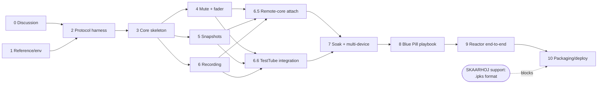

# TODO — Soundcraft Ui Device Core Roadmap

Each milestone has a human-readable checklist and a **Gate** — a set of agent-assertable
success criteria that must all pass before the next milestone begins. Gates are written so
an agent can verify them mechanically (build commands, greps, test runs, protocol traces).

Design details and rationale for every item live in [IMPLEMENTATION.md](IMPLEMENTATION.md).

---

## 0. Interactive discussion items (resolve with project owner first) ⚠️

Findings from initial research that need human input before or during early milestones.
Full context for each is in [IMPLEMENTATION.md](IMPLEMENTATION.md) § "Open questions".

- [x] **Licensing:** resolved 2026-07-20 — see Decision log. Summary: BSD-3 for our own
      code + free (non-sold) source distribution is compatible with all dependency terms.
      Commons Clause only forbids *selling*; go.mod deps are fetched by users, not
      redistributed by us. Anything copied near-verbatim from `core-skaarhoj-template`
      must retain Apache-2.0 + Commons Clause attribution (prefer writing from the
      IMPLEMENTATION.md spec instead). Residual (accepted) risk: `ibeam-corelib-go` /
      `ibeam-core-proto` / `ibeam-lib-env` lack a LICENSE file — implied license only;
      prefer source-only releases and optionally ask SKAARHOJ to add a LICENSE.
- [x] **On-device deployment — approach set 2026-07-20.** Runs on the Blue Pill. We build
      the core as a standard `.ipks`, a gzipped opkg/ipk holding the arm64 binary at
      `/usr/bin/<core>` plus a runit service under `/service/pkg/<core>`. We install it
      through the system-manager local-upload page (`POST /api/install-custom-package`).
      Working assumption: that upload installs and supervises a self-built core.
      Milestone 10 verifies this on hardware. If it fails, we pause and work with SKAARHOJ
      to identify the supported path for publishing a third-party core. Format details in
      IMPLEMENTATION.md §8.
- [x] **Which Ui models to actually test against:** resolved 2026-07-20 — see Decision
      log. Hardware on hand is a **Ui16**; that is the integration-test authority. All
      three models (Ui12, Ui16, Ui24R) are still registered so future users can use the
      core; Ui24R-only features (multitrack) are implemented from spec but marked
      untested on hardware.
- [x] **Snapshot UX decision:** resolved 2026-07-20 — see Decision log. Up/down
      (previous/next) snapshot stepping within the current show, plus a read-only
      current-snapshot-name display parameter. No dynamic option-list parameter in v1.
- [x] **Recording control style:** resolved 2026-07-20 — see Decision log. Single toggle
      with state feedback (matches the mixer's own web UI); the button displays the
      actual `var.isRecording` state; the inherent race window is accepted.
- [x] **Channel dimension scope for v1:** resolved 2026-07-20 — see Decision log.
      Master-mix mute + fader for input (`i`) and line-in (`l`) channels, plus the master
      fader (`m.mix`). Note: the mixer exposes no master mute path (only `m.dim`), so
      there is no master-mute parameter. Player/FX/sub/aux/VCA and per-bus sends deferred.
- [x] **Go WebSocket library + target arch:** resolved 2026-07-20 — see Decision log.
      `gorilla/websocket`, and Blue Pill is confirmed **arm64** (package Architecture
      field of the sample package; static Go build, `GOOS=linux GOARCH=arm64`).

**Gate G0 (agent-assertable):**
- [x] Every checkbox above is either checked or converted into a dated decision entry in
      IMPLEMENTATION.md § "Decision log".
- [x] `grep -c "DECISION:" IMPLEMENTATION.md` ≥ number of resolved items.

---

## 1. Reference material & environment

> Full, copy-pasteable rebuild instructions (pinned commits, manual URLs, owner-provided
> artifacts, and SHA-256 checksums) live in [README.md](README.md) → "Reference material".
> `reference/` is git-ignored, so this must be redone in every fresh container.

- [x] Clone `soundcraft-ui`, `core-skaarhoj-template`, `ibeam-core-proto`,
      `ibeam-corelib-go`, `ibeam-lib-config` into `reference/` (pinned commits per README)
- [x] Download the four SKAARHOJ PDF manuals into `reference/manuals/`
- [x] Place the owner-provided artifacts in `reference/ipks-sample/` (sample `.ipks`
      package + skaarOS `.raucb` image — not publicly fetchable; obtain from the owner)
- [x] `reference/` excluded from git via `.gitignore`
- [ ] Verify the rebuilt snapshot matches: `sha256sum -c` against the checksums in the
      README (manuals may differ if updated upstream; clones are commit-pinned)
- [x] Install Go toolchain matching `ibeam-corelib-go` requirement (Go ≥ 1.25) in the dev
      container — pinned to 1.25.14 in `.devcontainer/devcontainer.json` via the Go
      feature, because the devcontainers Go image only publishes up to 1.24
- [x] Verify the SKAARHOJ template builds: `cd reference/core-skaarhoj-template &&
      bash injectGitVars.sh && go build ./...`. The `injectGitVars.sh` step is required —
      it generates `gitinfo.go`, without which `main.go` fails on undefined `gitTag`,
      `gitBranch` and `gitRevision`

**Gate G1 (agent-assertable):**
- [ ] `ls reference/soundcraft-ui reference/core-skaarhoj-template reference/ibeam-core-proto reference/ibeam-corelib-go reference/ibeam-lib-config reference/manuals reference/ipks-sample` all exist
- [ ] Each clone is at its pinned commit, e.g. `git -C reference/soundcraft-ui rev-parse HEAD` starts with `93db985`
- [ ] `ls reference/manuals/*.pdf | wc -l` == 4 and each file begins with `%PDF`
- [ ] `ls reference/ipks-sample/*.ipks reference/ipks-sample/*.raucb` both exist
- [ ] `git check-ignore reference/soundcraft-ui` exits 0
- [x] `go version` reports ≥ go1.25
- [x] `bash injectGitVars.sh && go build ./...` succeeds in `reference/core-skaarhoj-template`

---

## 2. Protocol validation harness (throwaway, not in repo)

Before writing the core, empirically validate the protocol facts extracted from
`soundcraft-ui` against a real mixer (or its offline demo, see IMPLEMENTATION.md).

Validated 2026-08-23 against a Ui16 (firmware `1.0.7548-ui16`). Results table and full
findings in [IMPLEMENTATION.md](IMPLEMENTATION.md) §9.

- [x] Write a throwaway Go (or Node) WebSocket probe in `/tmp` (NOT committed) that:
      connects to `ws://<mixer-ip>/socket.io/1/websocket` or `ws://<mixer-ip>` as required,
      sends `ALIVE` keepalives, logs the initial state dump, and can send raw messages
      — stdlib-only Python RFC6455 client; both URLs work, bare `ws://<ip>` chosen
- [x] Confirm initial dump contains `SETD^i.<n>.mute^`, `SETD^i.<n>.mix^`, `SETS^var.currentShow^`,
      `SETD^var.isRecording^` keys
- [x] Confirm `SETD^i.0.mute^1` mutes channel 1 and that the change is echoed back
      — mute works; the **echo does not**. The mixer never returns a write to its sender
- [x] Confirm mute/fader changes made in the mixer's own web UI arrive as unsolicited messages
      — confirmed via a second WebSocket client (41–75 ms); the web UI itself was not exercised
- [x] Confirm `SHOWLIST` / `SNAPSHOTLIST^<show>` request-response formats
      — both confirmed; `CUELIST` draws no reply on this firmware
- [x] Confirm `LOADSNAPSHOT^<show>^<snap>` works and updates `var.currentSnapshot`
- [x] Confirm `RECTOGGLE` toggles `var.isRecording` (and observe `var.recBusy` timing:
      does it cover the start/stop transition while `isRecording` lags, i.e. file
      open/finalize on the USB stick?)
      — it does not cover it: never fires on start, ~76 ms pulse on stop
- [x] Observe idle traffic: confirm the mixer sends continuous data (VU/state) usable for
      read-deadline dead-link detection, and what happens on power-off (TCP FIN vs.
      silent drop) — the SKAARHOJ routinely cuts mixer power in the target installation
      — idle traffic confirmed (worst gap 2.65 s); **power-off behavior still untested**
- [x] Record any deviations from the soundcraft-ui-derived spec in IMPLEMENTATION.md

**Gate G2 (agent-assertable):**
- [x] IMPLEMENTATION.md § "Protocol validation results" contains a table with one PASS/FAIL/
      DEVIATION row per bullet above, each with a captured message excerpt
- [x] No row is FAIL without a linked mitigation entry in the Decision log
      — no FAIL rows; each of the three DEVIATION rows has a dated Decision log entry
- [x] No probe/test code exists in the repo: `git status --porcelain` shows only
      documentation changes

**Carried forward:** mixer power-cycle behavior (TCP FIN vs. silent drop) is unverified —
exercise it in milestone 7's soak test. The mixer's own web UI was never driven directly;
feedback was proven with a second WebSocket client instead.

---

## 3. Core skeleton (first committed code)

- [x] Copy/adapt the template layout: `main.go`, `parameters.go`, `process.go`, `config.go`
      (module name `skaarhoj_soundcraft` or agreed name; rename all
      `core-skaarhoj-template` references)
- [x] CoreInfo metadata: name, label "Soundcraft Ui", device category Audio, connection type
      TCP/WebSocket, DeviceWebUILink `http://{ip}/`
- [x] Register three models: Ui12, Ui16, Ui24R with per-model channel counts
- [x] Config schema: devices list with IP (embed `BaseDeviceConfig`)
- [x] Connection-state parameter `connection` (GenericType ConnectionState) registered
      explicitly and reported on WS connect/disconnect; no parameter sets
      `controllableWhileDisconnected`, so Reactor indicates and blocks outputs while the
      mixer is powered off
- [x] WebSocket client: connect, `3:::` frame handling (if confirmed in G2), newline-split
      batch parsing, `ALIVE` keepalive every 1 s, reconnect **forever** with 2 s backoff
      (mixer power-cycling by the SKAARHOJ is routine), read deadline for dead-link
      detection (power cut sends no FIN), state-change-only connection logging
- [x] In-memory mixer state store (flat `map[string]value` mirroring SETD/SETS paths);
      cleared on disconnect; writes arriving while disconnected are discarded, not queued

**Gate G3 (agent-assertable):**
- [x] `go build ./...` and `go vet ./...` succeed at repo root
- [x] `go test ./...` passes; unit tests exist for: frame encode/decode, message parse
      (SETD/SETS/BMSG/list replies), reconnect state machine (with mocked conn),
      dead-link detection (mocked conn goes silent → redial), store cleared and writes
      discarded while disconnected
- [x] Running the core with a stub config starts the gRPC server (log line asserts listen
      address) and retries the mixer connection without crashing for ≥ 60 s against a
      non-existent IP — verified 2026-08-23, 70 s against 192.0.2.55, one transition log
- [x] Against a real/demo mixer: log shows connection established and ≥ 1 state message
      ingested; connection parameter reports connected=1 — verified 2026-08-23 against
      the owner's Ui16, read-only (ALIVE keepalives only)

---

## 4. Feature: channel mute + fader (with feedback)

- [x] Parameter: `channel_mute` (Binary, ControlStyle Normal, NormalFeedback), dimensioned
      over channels per model (inputs + line-in, per G0 decision)
- [x] Parameter: `channel_fader` (Floating 0–100 linear-tick, Normal, NormalFeedback,
      acceptanceThreshold, dB display via displaySuffix + conversion for labels)
      — value is 0–100 with a linear tick; the wire stays linear 0.0–1.0 (value/100).
      A read-only `channel_fader_db` String companion carries the dB reading and is the
      fader's RecommendedParamForTextDisplay (Decision log 2026-08-23, superseding the
      earlier linear-0.0–1.0 readout)
- [x] Parameter: `master_fader` (`m.mix`; note: no master mute path exists on the mixer),
      plus its read-only `master_fader_db` String display companion
- [x] Outbound: target changes → `SETD^{i|l}.<n>.mute^{0|1}` / `SETD^{i|l}.<n>.mix^<float>`
- [x] Inbound: unsolicited `SETD` updates → ingest as current values
- [x] Fader value → dB conversion utilities ported from soundcraft-ui (with unit tests
      against the reference vectors listed in IMPLEMENTATION.md)

**Gate G4 (agent-assertable):**
- [x] Unit tests: dB↔linear conversion matches reference vectors within 0.05 dB; mute/fader
      path construction matches the exact strings from soundcraft-ui's outbound-messages
      test suite (sampled ≥ 6 cases) — 18 vectors generated from the TS implementation and
      independently recomputed; 12 verbatim spec strings
- [x] Integration (real/demo mixer): setting mute from the core changes the mixer web UI
      within 250 ms; changing mute in the mixer web UI updates the core's current value
      (observable in logs / gRPC Subscribe) within 250 ms; same for fader — verified
      2026-08-23 against the Ui16, driving the running core over gRPC: core→mixer observed
      in 49–174 ms, mixer→core in 30–64 ms. The "web UI" legs were proxied through a
      second WebSocket client (milestone-2 precedent); one of ten broadcast samples hit
      358 ms (mixer-side variance). All touched values captured first and restore-verified
- [x] Feedback loop safety: driving a fader through 100 rapid updates does not produce
      message storms (log assertion: outbound count ≤ inbound-triggered resend threshold)
      — unit test: exactly 100 SETD for 100 updates, no resends; live via gRPC: corelib
      coalesced the burst to 2 SETD, no tail traffic

---

## 5. Feature: snapshot restore (with feedback)

- [x] On connect: request `SHOWLIST`, then `SNAPSHOTLIST^<show>` for the current show;
      cache results; refresh on `var.currentShow` change
- [x] Parameters: `snapshot_up` / `snapshot_down` (NoValue, Oneshot triggers) — step to
      the adjacent snapshot within the current show's cached list (wrap at list ends) and
      send `LOADSNAPSHOT^<show>^<snap>` (per G0 decision; no dynamic option list in v1)
- [x] Feedback: `var.currentShow` / `var.currentSnapshot` → read-only string parameters
      for display use (current snapshot name on the button/display) — implemented as one
      `current_snapshot` parameter showing the snapshot name; no `current_show` parameter
      (Decision log 2026-08-23, flagged for owner review)
- [x] Handle empty-list edge case (`CUELIST^Default^` trailing-separator format) and
      unknown current snapshot (not in cached list) — up/down becomes no-op with log

**Gate G5 (agent-assertable):**
- [x] Unit tests: list-reply parser handles flat (`SHOWLIST^a^b`), keyed
      (`SNAPSHOTLIST^show^s1^s2`), and empty (`CUELIST^Default^`) forms; up/down stepping
      logic (adjacency, wrap-around, empty/unknown-current no-op)
- [x] Integration: snapshot up/down from the core loads the adjacent snapshot and
      `var.currentSnapshot` feedback matches the loaded name; loading a snapshot from
      the mixer web UI updates the core's current-snapshot display parameter — verified
      2026-08-23 against the Ui16 over gRPC: up/down stepped with wrap-around both
      directions (feedback in 214–292 ms); an external load updated the display in ~20 ms.
      The "web UI" leg was proxied through a second WebSocket client (milestone-2
      precedent). Original snapshot restored; state fingerprint matched except three
      mixer-internal uptime counters

---

## 6. Feature: USB recording start/stop (with feedback)

- [x] Parameters: `record_2track` toggle (Binary, Normal, NormalFeedback — per G0
      decision; button displays actual state), plus read-only `record_busy`
- [x] Outbound: send `RECTOGGLE` when target differs from current state (symmetric —
      handles both start and stop); after sending, run the core-side in-flight guard —
      ignore further toggles until `var.isRecording` reaches the target or ~2 s elapses.
      This REPLACED the planned `var.recBusy`=1 suppression, which milestone 2 proved
      cannot cover the ~206 ms command-to-state race (§9, Decision log 2026-08-23). Race
      window accepted (matches the mixer's own UI behavior)
- [x] Inbound: `var.isRecording`, `var.recBusy` → current values
- [x] (Ui24R stretch) `MTK_REC_TOGGLE` + `var.mtk.rec.currentState`, `var.mtk.rec.busy`,
      `var.mtk.rec.time`; parameters registered only for the Ui24R model — implemented
      from spec, untested on hardware (no Ui24R)

**Gate G6 (agent-assertable):**
- [x] Unit tests: state-gated toggle logic (no `RECTOGGLE` sent when already in target
      state; exactly one sent otherwise; a second toggle inside the in-flight window is
      suppressed; the window expires or a matching `var.isRecording` clears the guard and
      a subsequent write sends again; guard resets on disconnect)
- [x] Integration: start via core → mixer records (`var.isRecording`=1); stop via core →
      recording stops; external toggles update core state — verified 2026-08-23 against
      the Ui16: exactly one `RECTOGGLE` per intent (a rapid triple-press produced one),
      confirm at ~123 ms, the `record_busy` stop pulse observed, no MaxRetrys errors,
      and an external stop 1.29 s after a core press was accepted with no re-fight
      (validates `QuarantineDelayMs` = 0). Ended with `var.isRecording`=0 verified from a
      fresh connection. The "web UI" legs were proxied through a second WebSocket client
      (milestone-2 precedent); Reactor-in-the-loop behavior remains for milestone 9's
      end-to-end test
- [x] Model gating: multitrack parameters absent for Ui12/Ui16 models in gRPC
      ParameterDetail listing — asserted in unit tests via corelib's per-model
      `GetParameterDetail` and confirmed 2026-08-23 in the live gRPC listing of the
      running core (absent for Ui12/Ui16, present for Ui24R)

---

## 6.5 Remote-core attach (dev loop without on-device install)

Reactor's Device Core Sharing connects to device cores on a remote host: a core's
Address setting takes a remote IP, and sharing "uses port 8502 by default" (Reactor
manual; docs.skaarhoj.com → "Shared Device Cores"). Our core already serves ibeam gRPC
on `:8502` when run off skaarOS. The docs describe only Blue Pills as sharing hosts and
do not explain how one port serves multiple cores or whether Reactor will attach to a
bare core on a generic machine — that is not knowable from the docs, so this milestone
settles it by experiment. Requires the owner and the Blue Pill on the same subnet.

- [x] Run the core in the dev container (listens on `:8502`); on the Blue Pill, add the
      core with the dev machine's IP as Address (manual entry; also try the
      "Shared Core" discovery path and note whether the bare core is discovered)
      — works via a TCP forwarder on a site PC; discovery finds nothing (expected),
      manual entry under "Remote or Unknown" is the path (IMPLEMENTATION.md §9.3)
- [x] If Reactor attaches: drive mute, fader, snapshot up/down, and record from the
      browser panel simulator against the Ui16; note per-parameter results, including
      whether `channel_fader` pairs per-channel with `channel_fader_db` on displays
      — mute and fader driven and confirmed on the wire; button feedback rendered.
      Snapshot/record not exercised. The dB display binding produced no visible text
      in the simulator, and the channel-name title was never observed — both carried
      to milestone 9's Reactor end-to-end item
- [x] Document the outcome: a working no-install dev flow in README, or a dated
      Decision-log entry that remote attach needs a real Blue Pill host and testing
      goes through `.ipks` installs — results in IMPLEMENTATION.md §9.3, including the
      panel binding syntax so configurations can be authored as JSON and imported

**Gate G6.5 (agent-assertable):**
- [x] Either a log/trace shows Reactor on the Blue Pill controlling the Ui16 through the
      dev-container core (panel-simulator action → mixer change), or a dated `DECISION:`
      entry records that this path is unsupported and why — observer WebSocket captured
      `SETD^i.0.mute^0`, `^1`, `SETD^i.0.mix^0.102`, `^0.097` from simulator actions
      while the core ran in the dev container (2026-08-24)

---

## 6.6 TestTube-driven hardware integration

TestTube is SKAARHOJ's official tool for developing and testing device cores
(github.com/SKAARHOJ/ibeam-testtube-releases; pinned v1.0.14-pre2, sha256
`e9fea85efdc96bc9a7cc465bad6cbfc06c9cf1dfa028e4d6290d59e71702494d`, kept in the
git-ignored `reference/testtube/` — never commit the binary). It dials the core's gRPC
endpoint (default `127.0.0.1:8502`), so this block runs from the dev container alone —
no Blue Pill required. The core connects to the real Ui16; every touched mixer value is
captured first and restore-verified afterwards (milestone-2 discipline).

- [x] Enumerate the registered parameters through TestTube against the running core and
      confirm the listing matches the v1 catalog for the configured model
- [x] Drive each controllable parameter with `testtube test <pattern> <parameter>`:
      `channel_mute` (≥ 2 channels including a line-in), `channel_fader` (bounds 0/100
      and mid values), `master_fader`, `record_2track` (start then stop) — verify each
      action on the mixer via an observer WebSocket client, and verify feedback (current
      value plus the dB companion text) through the core — done 2026-08-23; the pattern
      engine proved safe only for `master_fader` (dry-run), so hardware drives went
      through TestTube's grpc-web proxy, the surface its own web UI uses (see
      IMPLEMENTATION.md §9.2 for the pattern-engine limitations)
- [x] `snapshot_up` / `snapshot_down`: exercise through TestTube if it supports Oneshot
      triggers; otherwise record the limitation and cover via direct gRPC, labeled as
      such in the results — no trigger pattern exists; triggers were sent through
      TestTube's grpc-web proxy and worked (wrap both directions, ~197 ms confirm)
- [x] End state: original values restored and verified (state fingerprint),
      `var.isRecording` = 0 from a fresh connection — fingerprints differ only in
      mixer-internal `var.spi*` counters; two fader values found drifted pre-test were
      restored to their live (non-snapshot) values
- [x] Record results in IMPLEMENTATION.md § "TestTube integration results": one row per
      v1 parameter, PASS/FAIL/LIMITATION, each with a captured evidence excerpt

**Gate G6.6 (agent-assertable):**
- [x] The results table has a row for every v1 parameter; no FAIL row lacks a linked
      Decision-log mitigation entry — all rows PASS except the pattern-coverage
      LIMITATION row; zero FAIL rows
- [x] Restore proof recorded; `git status --porcelain` shows only documentation changes
      (no binaries or test artifacts committed)

---

## 7. Hardening: reconnect soak, multi-device, cross-compile

Dev container only — no Blue Pill and no Reactor in the loop. Everything here is
mechanically assertable, so it can be delegated to `core-builder` and attacked by
`adversarial-validator`. Run it before pointing a panel at the core (milestones 8–9), so
that an end-to-end failure cannot be blamed on reconnect or resync behavior.

Mixer power is switched by a network PDU outlet. Its address, credentials, which outlet,
and the read/write API calls are all in `reference/site.md`. Never switch another outlet.

- [ ] Confirm the PDU accepts writes before planning around it: the NETIO JSON API is
      read-open but writes need M2M write access enabled. If writes are refused, record
      that and fall back to asking the owner to switch the outlet by hand
- [ ] Reconnect soak: ≥ 3 mixer power-cycles via output 3. Assert per cycle — the read
      deadline detects the loss, `connection` goes 0 then 1, the store and snapshot cache
      are cleared, no command is replayed at power-on, and the post-resync store matches a
      fresh independent dump of the mixer
- [ ] **Close the milestone-2 carry-forward:** record whether a power cut produces a TCP
      FIN or silent death, and how long detection actually takes, in IMPLEMENTATION.md §9
- [ ] Network pull without touching power: cut the TCP path abruptly (`wsproxy.py` in
      `reference/tools/`) and assert the same recovery. Also cover a mixer-initiated
      reboot if the mixer offers one
- [ ] Writes issued while disconnected are discarded, not queued — assert no wire traffic
      at reconnect beyond the normal `ALIVE` / `SHOWLIST` opening
- [ ] Multi-device: configure the real Ui16 alongside a second simulated mixer
      (`fakemixer66.py`), ideally as a different model so dimension counts differ. Assert
      no cross-talk — a write to device 2 never appears on device 1's wire, each device
      has its own `connection` parameter, and powering one down leaves the other serving
- [ ] Cross-compile for the Blue Pill: `GOOS=linux GOARCH=arm64 CGO_ENABLED=0`; document
      the command in the README

**Gate G7 (agent-assertable):**
- [ ] `go test ./...` green; `go vet` clean; binaries build for the host and for
      `linux/arm64` (`file` reports an ARM aarch64 ELF)
- [ ] Soak log: ≥ 3 forced disconnects, each with automatic recovery and a post-resync
      store fingerprint equal to a fresh direct mixer dump (`fpcap.py`)
- [ ] IMPLEMENTATION.md §9 states the observed power-off failure mode and detection time,
      replacing the "power-off behavior still untested" carry-forward
- [ ] Multi-device trace shows zero device-2 paths on device 1's connection and vice versa
- [ ] PDU output 3 reads `State: 1` at the end of the run

---

## 8. Blue Pill operations playbook (legwork before end-to-end)

Milestone 6.5 got a result but took about an hour of trial and error at the panel. This
milestone pays that cost down **before** the end-to-end run, so milestone 9 is a sequence
of known moves rather than a search. Nothing here touches the mixer.

Back up first: export every project on the QuickBar into `reference/backups/<date>/`
before making any change (rule in `reference/site.md`).

- [ ] Map the surface we actually drive: login/EULA, project list, export, import,
      activate, add/remove remote device, logs, packages page. One line per call — method,
      path, what it returns, whether it needs the session cookie
- [ ] Author the full v1 binding project as JSON and import it, rather than clicking it
      together: a `.rpj` is a gzipped tar of a `conf/` tree and carries `HWCBehaviors`.
      Cover **every** v1 parameter — mute button, channel fader, master fader, record
      toggle, snapshot up/down triggers, snapshot-name display, dB display, channel-name
      title
- [ ] Find the behavior (`ParentID`) that each parameter type needs. Milestone 6.5 knows
      `SKAARHOJ:Toggle`, `SKAARHOJ:StepChange`, `SKAARHOJ:DisplayValue`; triggers and
      title displays are unknown. Get the list from Reactor rather than guessing
- [ ] One command to reset the QuickBar to its pre-test baseline (import the backup,
      re-activate the original project). Prove it works before milestone 9 needs it
- [ ] Write down what the panel simulator renders and what it does not — milestone 6.5
      saw a `DisplayValue` binding stay blank there. Decide whether the simulator or the
      physical Quick Bar is the authority for milestone 9's display rows
- [ ] Where to read failures: which log surface shows a rejected binding or a failed
      attach, and how to correlate timestamps (the device clock runs behind UTC)
- [ ] **Stop rule.** If any step above is not settled in three attempts, stop and write
      down what is unknown and what was tried. Do not iterate blind — that is the failure
      mode this milestone exists to prevent
- [ ] Record site-specific recipes in `reference/tools/README.md` (git-ignored) and
      protocol-level facts in IMPLEMENTATION.md §9.4

**Gate G8 (agent-assertable):**
- [ ] One scripted command imports the v1 binding project; a text dump of the
      configuration asserts every v1 parameter appears bound
- [ ] One scripted command restores the baseline; asserted by comparing the project list
      and active project against the backup taken at the start
- [ ] IMPLEMENTATION.md §9.4 gives, for every v1 parameter, the behavior `ParentID` and
      the `Raw` reference string used to bind it — or names the ones still unknown
- [ ] `reference/backups/<date>/` holds a pre-change export of every project on the device
- [ ] `git status --porcelain` shows only documentation changes

---

## 9. Reactor end-to-end on the QuickBar

Runs the core in the dev container and reaches it from the QuickBar over the milestone-6.5
remote-attach path, so no package install is needed and this milestone is **not** blocked
on SKAARHOJ.

**Run this interactively in the main session — do not delegate it to a subagent.** The
owner follows along and can intervene; a long opaque subagent run is what made 6.5
painful. Work in small steps and report after each.

- [ ] Attach the dev-container core through the relay; confirm Reactor reports Connected
      and takes its parameter catalog from the core
- [ ] Import the milestone-8 binding project; confirm every binding resolves
- [ ] Drive each v1 parameter from the panel and confirm the effect on the mixer through
      an observer WebSocket: `channel_mute`, `channel_fader`, `master_fader`,
      `record_2track`, `snapshot_up` / `snapshot_down`
- [ ] Confirm feedback in the other direction: change each value from a second WebSocket
      client and see the panel follow (button LED, fader position, displays)
- [ ] **Resolve the two 6.5 unknowns:** whether `channel_fader_db` renders on a display
      binding, and whether `RecommendedParamForTitleDisplay` puts the channel name on the
      panel
- [ ] Power-cycle the mixer with the panel attached (PDU output 3): Reactor indicates the
      disconnect and blocks output, recovery is automatic, and nothing pressed while the
      mixer was off fires when it returns
- [ ] Restore: mixer values byte-identical to baseline from a fresh connection, QuickBar
      back to its baseline project set
- [ ] README: Installation (build from source), Configuration, and Parameters sections
- [ ] Record results in IMPLEMENTATION.md § "Reactor end-to-end results"

**Gate G9 (agent-assertable):**
- [ ] The results table has one row per v1 parameter with PASS/FAIL/LIMITATION and a
      captured evidence excerpt; no FAIL row lacks a linked Decision-log entry
- [ ] The dB-display row and the channel-title row are each resolved — neither is left
      "NOT SHOWN" or "UNTESTED"
- [ ] A power-cycle-with-panel-attached row is present and records what Reactor showed
- [ ] Restore proof recorded for both the mixer and the QuickBar
- [ ] `grep -E "^## (Installation|Configuration|Parameters)" README.md` finds all three

---

## 10. Packaging & on-device deployment ⛔ blocked on SKAARHOJ support

**Blocked.** IMPLEMENTATION.md §8 documents the `.ipks` container as observed in one
sample package, including a 63-byte header whose fields are SKAARHOJ-internal, and the
maintainer scripts are stamped by a `skaarOS-cli` tool that is not public. Building an
installable package from that alone would be guesswork. We are waiting on SKAARHOJ support
to describe the supported path. Do not start this milestone by trying to synthesize the
header.

Milestones 7–9 deliberately avoid needing this: the core is exercised on real hardware
through the remote-attach path instead.

- [ ] Get from SKAARHOJ: how a third party builds and (if required) signs an `.ipks`, and
      whether `skaarOS-cli` or an equivalent is available to us
- [ ] Script the build + package step once the format is confirmed
- [ ] Install through the system-manager local-upload page and confirm runit supervises
      the core and Reactor lists it as a local core
- [ ] Re-run the milestone-9 parameter checks against the installed core, to show the
      remote-attach results carry over
- [ ] README: Deployment section

**Gate G10 (agent-assertable):**
- [ ] A build script produces an `.ipks` and the package installs without manual steps
- [ ] The installed core survives a device reboot and reappears in Reactor
- [ ] Milestone-9 results reproduce against the installed core
- [ ] `grep -E "^## Deployment" README.md` succeeds

---

## Milestone order & dependencies

