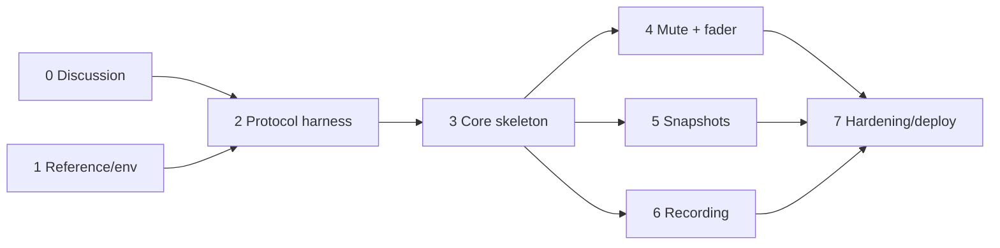

# TODO — Soundcraft Ui Device Core Roadmap

Each milestone has a human-readable checklist and a **Gate** — a set of agent-assertable
success criteria that must all pass before the next milestone begins. Gates are written so
an agent can verify them mechanically (build commands, greps, test runs, protocol traces).

Design details and rationale for every item live in [IMPLEMENTATION.md](IMPLEMENTATION.md).

---

## 0. Interactive discussion items (resolve with project owner first) ⚠️

Findings from initial research that need human input before or during early milestones.
Full context for each is in [IMPLEMENTATION.md](IMPLEMENTATION.md) § "Open questions".

- [x] **Licensing:** resolved 2026-07-20 — see Decision log. Summary: BSD-3 for our own
      code + free (non-sold) source distribution is compatible with all dependency terms.
      Commons Clause only forbids *selling*; go.mod deps are fetched by users, not
      redistributed by us. Anything copied near-verbatim from `core-skaarhoj-template`
      must retain Apache-2.0 + Commons Clause attribution (prefer writing from the
      IMPLEMENTATION.md spec instead). Residual (accepted) risk: `ibeam-corelib-go` /
      `ibeam-core-proto` / `ibeam-lib-env` lack a LICENSE file — implied license only;
      prefer source-only releases and optionally ask SKAARHOJ to add a LICENSE.
- [x] **On-device deployment — approach set 2026-07-20.** Runs on the Blue Pill. We build
      the core as a standard `.ipks`, a gzipped opkg/ipk holding the arm64 binary at
      `/usr/bin/<core>` plus a runit service under `/service/pkg/<core>`. We install it
      through the system-manager local-upload page (`POST /api/install-custom-package`).
      Working assumption: that upload installs and supervises a self-built core.
      Milestone 7 verifies this on hardware. If it fails, we pause and work with SKAARHOJ
      to identify the supported path for publishing a third-party core. Format details in
      IMPLEMENTATION.md §8.
- [x] **Which Ui models to actually test against:** resolved 2026-07-20 — see Decision
      log. Hardware on hand is a **Ui16**; that is the integration-test authority. All
      three models (Ui12, Ui16, Ui24R) are still registered so future users can use the
      core; Ui24R-only features (multitrack) are implemented from spec but marked
      untested on hardware.
- [x] **Snapshot UX decision:** resolved 2026-07-20 — see Decision log. Up/down
      (previous/next) snapshot stepping within the current show, plus a read-only
      current-snapshot-name display parameter. No dynamic option-list parameter in v1.
- [x] **Recording control style:** resolved 2026-07-20 — see Decision log. Single toggle
      with state feedback (matches the mixer's own web UI); the button displays the
      actual `var.isRecording` state; the inherent race window is accepted.
- [x] **Channel dimension scope for v1:** resolved 2026-07-20 — see Decision log.
      Master-mix mute + fader for input (`i`) and line-in (`l`) channels, plus the master
      fader (`m.mix`). Note: the mixer exposes no master mute path (only `m.dim`), so
      there is no master-mute parameter. Player/FX/sub/aux/VCA and per-bus sends deferred.
- [x] **Go WebSocket library + target arch:** resolved 2026-07-20 — see Decision log.
      `gorilla/websocket`, and Blue Pill is confirmed **arm64** (package Architecture
      field of the sample package; static Go build, `GOOS=linux GOARCH=arm64`).

**Gate G0 (agent-assertable):**
- [x] Every checkbox above is either checked or converted into a dated decision entry in
      IMPLEMENTATION.md § "Decision log".
- [x] `grep -c "DECISION:" IMPLEMENTATION.md` ≥ number of resolved items.

---

## 1. Reference material & environment

> Full, copy-pasteable rebuild instructions (pinned commits, manual URLs, owner-provided
> artifacts, and SHA-256 checksums) live in [README.md](README.md) → "Reference material".
> `reference/` is git-ignored, so this must be redone in every fresh container.

- [x] Clone `soundcraft-ui`, `core-skaarhoj-template`, `ibeam-core-proto`,
      `ibeam-corelib-go`, `ibeam-lib-config` into `reference/` (pinned commits per README)
- [x] Download the four SKAARHOJ PDF manuals into `reference/manuals/`
- [x] Place the owner-provided artifacts in `reference/ipks-sample/` (sample `.ipks`
      package + skaarOS `.raucb` image — not publicly fetchable; obtain from the owner)
- [x] `reference/` excluded from git via `.gitignore`
- [ ] Verify the rebuilt snapshot matches: `sha256sum -c` against the checksums in the
      README (manuals may differ if updated upstream; clones are commit-pinned)
- [x] Install Go toolchain matching `ibeam-corelib-go` requirement (Go ≥ 1.25) in the dev
      container — pinned to 1.25.14 in `.devcontainer/devcontainer.json` via the Go
      feature, because the devcontainers Go image only publishes up to 1.24
- [x] Verify the SKAARHOJ template builds: `cd reference/core-skaarhoj-template &&
      bash injectGitVars.sh && go build ./...`. The `injectGitVars.sh` step is required —
      it generates `gitinfo.go`, without which `main.go` fails on undefined `gitTag`,
      `gitBranch` and `gitRevision`

**Gate G1 (agent-assertable):**
- [ ] `ls reference/soundcraft-ui reference/core-skaarhoj-template reference/ibeam-core-proto reference/ibeam-corelib-go reference/ibeam-lib-config reference/manuals reference/ipks-sample` all exist
- [ ] Each clone is at its pinned commit, e.g. `git -C reference/soundcraft-ui rev-parse HEAD` starts with `93db985`
- [ ] `ls reference/manuals/*.pdf | wc -l` == 4 and each file begins with `%PDF`
- [ ] `ls reference/ipks-sample/*.ipks reference/ipks-sample/*.raucb` both exist
- [ ] `git check-ignore reference/soundcraft-ui` exits 0
- [x] `go version` reports ≥ go1.25
- [x] `bash injectGitVars.sh && go build ./...` succeeds in `reference/core-skaarhoj-template`

---

## 2. Protocol validation harness (throwaway, not in repo)

Before writing the core, empirically validate the protocol facts extracted from
`soundcraft-ui` against a real mixer (or its offline demo, see IMPLEMENTATION.md).

Validated 2026-08-23 against a Ui16 (firmware `1.0.7548-ui16`). Results table and full
findings in [IMPLEMENTATION.md](IMPLEMENTATION.md) §9.

- [x] Write a throwaway Go (or Node) WebSocket probe in `/tmp` (NOT committed) that:
      connects to `ws://<mixer-ip>/socket.io/1/websocket` or `ws://<mixer-ip>` as required,
      sends `ALIVE` keepalives, logs the initial state dump, and can send raw messages
      — stdlib-only Python RFC6455 client; both URLs work, bare `ws://<ip>` chosen
- [x] Confirm initial dump contains `SETD^i.<n>.mute^`, `SETD^i.<n>.mix^`, `SETS^var.currentShow^`,
      `SETD^var.isRecording^` keys
- [x] Confirm `SETD^i.0.mute^1` mutes channel 1 and that the change is echoed back
      — mute works; the **echo does not**. The mixer never returns a write to its sender
- [x] Confirm mute/fader changes made in the mixer's own web UI arrive as unsolicited messages
      — confirmed via a second WebSocket client (41–75 ms); the web UI itself was not exercised
- [x] Confirm `SHOWLIST` / `SNAPSHOTLIST^<show>` request-response formats
      — both confirmed; `CUELIST` draws no reply on this firmware
- [x] Confirm `LOADSNAPSHOT^<show>^<snap>` works and updates `var.currentSnapshot`
- [x] Confirm `RECTOGGLE` toggles `var.isRecording` (and observe `var.recBusy` timing:
      does it cover the start/stop transition while `isRecording` lags, i.e. file
      open/finalize on the USB stick?)
      — it does not cover it: never fires on start, ~76 ms pulse on stop
- [x] Observe idle traffic: confirm the mixer sends continuous data (VU/state) usable for
      read-deadline dead-link detection, and what happens on power-off (TCP FIN vs.
      silent drop) — the SKAARHOJ routinely cuts mixer power in the target installation
      — idle traffic confirmed (worst gap 2.65 s); **power-off behavior still untested**
- [x] Record any deviations from the soundcraft-ui-derived spec in IMPLEMENTATION.md

**Gate G2 (agent-assertable):**
- [x] IMPLEMENTATION.md § "Protocol validation results" contains a table with one PASS/FAIL/
      DEVIATION row per bullet above, each with a captured message excerpt
- [x] No row is FAIL without a linked mitigation entry in the Decision log
      — no FAIL rows; each of the three DEVIATION rows has a dated Decision log entry
- [x] No probe/test code exists in the repo: `git status --porcelain` shows only
      documentation changes

**Carried forward:** mixer power-cycle behavior (TCP FIN vs. silent drop) is unverified —
exercise it in milestone 7's soak test. The mixer's own web UI was never driven directly;
feedback was proven with a second WebSocket client instead.

---

## 3. Core skeleton (first committed code)

- [x] Copy/adapt the template layout: `main.go`, `parameters.go`, `process.go`, `config.go`
      (module name `skaarhoj_soundcraft` or agreed name; rename all
      `core-skaarhoj-template` references)
- [x] CoreInfo metadata: name, label "Soundcraft Ui", device category Audio, connection type
      TCP/WebSocket, DeviceWebUILink `http://{ip}/`
- [x] Register three models: Ui12, Ui16, Ui24R with per-model channel counts
- [x] Config schema: devices list with IP (embed `BaseDeviceConfig`)
- [x] Connection-state parameter `connection` (GenericType ConnectionState) registered
      explicitly and reported on WS connect/disconnect; no parameter sets
      `controllableWhileDisconnected`, so Reactor indicates and blocks outputs while the
      mixer is powered off
- [x] WebSocket client: connect, `3:::` frame handling (if confirmed in G2), newline-split
      batch parsing, `ALIVE` keepalive every 1 s, reconnect **forever** with 2 s backoff
      (mixer power-cycling by the SKAARHOJ is routine), read deadline for dead-link
      detection (power cut sends no FIN), state-change-only connection logging
- [x] In-memory mixer state store (flat `map[string]value` mirroring SETD/SETS paths);
      cleared on disconnect; writes arriving while disconnected are discarded, not queued

**Gate G3 (agent-assertable):**
- [x] `go build ./...` and `go vet ./...` succeed at repo root
- [x] `go test ./...` passes; unit tests exist for: frame encode/decode, message parse
      (SETD/SETS/BMSG/list replies), reconnect state machine (with mocked conn),
      dead-link detection (mocked conn goes silent → redial), store cleared and writes
      discarded while disconnected
- [x] Running the core with a stub config starts the gRPC server (log line asserts listen
      address) and retries the mixer connection without crashing for ≥ 60 s against a
      non-existent IP — verified 2026-08-23, 70 s against 192.0.2.55, one transition log
- [x] Against a real/demo mixer: log shows connection established and ≥ 1 state message
      ingested; connection parameter reports connected=1 — verified 2026-08-23 against
      the Ui16 at 192.168.1.4, read-only (ALIVE keepalives only)

---

## 4. Feature: channel mute + fader (with feedback)

- [x] Parameter: `channel_mute` (Binary, ControlStyle Normal, NormalFeedback), dimensioned
      over channels per model (inputs + line-in, per G0 decision)
- [x] Parameter: `channel_fader` (Floating 0.0–1.0, Normal, NormalFeedback,
      acceptanceThreshold, dB display via displaySuffix + conversion for labels)
      — exposes the linear 0–1 value with no dB suffix; a suffix on a linear value would
      mislead, and corelib cannot re-scale a value for display (Decision log 2026-08-23)
- [x] Parameter: `master_fader` (`m.mix`; note: no master mute path exists on the mixer)
- [x] Outbound: target changes → `SETD^{i|l}.<n>.mute^{0|1}` / `SETD^{i|l}.<n>.mix^<float>`
- [x] Inbound: unsolicited `SETD` updates → ingest as current values
- [x] Fader value → dB conversion utilities ported from soundcraft-ui (with unit tests
      against the reference vectors listed in IMPLEMENTATION.md)

**Gate G4 (agent-assertable):**
- [x] Unit tests: dB↔linear conversion matches reference vectors within 0.05 dB; mute/fader
      path construction matches the exact strings from soundcraft-ui's outbound-messages
      test suite (sampled ≥ 6 cases) — 18 vectors generated from the TS implementation and
      independently recomputed; 12 verbatim spec strings
- [x] Integration (real/demo mixer): setting mute from the core changes the mixer web UI
      within 250 ms; changing mute in the mixer web UI updates the core's current value
      (observable in logs / gRPC Subscribe) within 250 ms; same for fader — verified
      2026-08-23 against the Ui16, driving the running core over gRPC: core→mixer observed
      in 49–174 ms, mixer→core in 30–64 ms. The "web UI" legs were proxied through a
      second WebSocket client (milestone-2 precedent); one of ten broadcast samples hit
      358 ms (mixer-side variance). All touched values captured first and restore-verified
- [x] Feedback loop safety: driving a fader through 100 rapid updates does not produce
      message storms (log assertion: outbound count ≤ inbound-triggered resend threshold)
      — unit test: exactly 100 SETD for 100 updates, no resends; live via gRPC: corelib
      coalesced the burst to 2 SETD, no tail traffic

---

## 5. Feature: snapshot restore (with feedback)

- [x] On connect: request `SHOWLIST`, then `SNAPSHOTLIST^<show>` for the current show;
      cache results; refresh on `var.currentShow` change
- [x] Parameters: `snapshot_up` / `snapshot_down` (NoValue, Oneshot triggers) — step to
      the adjacent snapshot within the current show's cached list (wrap at list ends) and
      send `LOADSNAPSHOT^<show>^<snap>` (per G0 decision; no dynamic option list in v1)
- [x] Feedback: `var.currentShow` / `var.currentSnapshot` → read-only string parameters
      for display use (current snapshot name on the button/display) — implemented as one
      `current_snapshot` parameter showing the snapshot name; no `current_show` parameter
      (Decision log 2026-08-23, flagged for owner review)
- [x] Handle empty-list edge case (`CUELIST^Default^` trailing-separator format) and
      unknown current snapshot (not in cached list) — up/down becomes no-op with log

**Gate G5 (agent-assertable):**
- [x] Unit tests: list-reply parser handles flat (`SHOWLIST^a^b`), keyed
      (`SNAPSHOTLIST^show^s1^s2`), and empty (`CUELIST^Default^`) forms; up/down stepping
      logic (adjacency, wrap-around, empty/unknown-current no-op)
- [x] Integration: snapshot up/down from the core loads the adjacent snapshot and
      `var.currentSnapshot` feedback matches the loaded name; loading a snapshot from
      the mixer web UI updates the core's current-snapshot display parameter — verified
      2026-08-23 against the Ui16 over gRPC: up/down stepped with wrap-around both
      directions (feedback in 214–292 ms); an external load updated the display in ~20 ms.
      The "web UI" leg was proxied through a second WebSocket client (milestone-2
      precedent). Original snapshot restored; state fingerprint matched except three
      mixer-internal uptime counters

---

## 6. Feature: USB recording start/stop (with feedback)

- [x] Parameters: `record_2track` toggle (Binary, Normal, NormalFeedback — per G0
      decision; button displays actual state), plus read-only `record_busy`
- [x] Outbound: send `RECTOGGLE` when target differs from current state (symmetric —
      handles both start and stop); after sending, run the core-side in-flight guard —
      ignore further toggles until `var.isRecording` reaches the target or ~2 s elapses.
      This REPLACED the planned `var.recBusy`=1 suppression, which milestone 2 proved
      cannot cover the ~206 ms command-to-state race (§9, Decision log 2026-08-23). Race
      window accepted (matches the mixer's own UI behavior)
- [x] Inbound: `var.isRecording`, `var.recBusy` → current values
- [x] (Ui24R stretch) `MTK_REC_TOGGLE` + `var.mtk.rec.currentState`, `var.mtk.rec.busy`,
      `var.mtk.rec.time`; parameters registered only for the Ui24R model — implemented
      from spec, untested on hardware (no Ui24R)

**Gate G6 (agent-assertable):**
- [x] Unit tests: state-gated toggle logic (no `RECTOGGLE` sent when already in target
      state; exactly one sent otherwise; a second toggle inside the in-flight window is
      suppressed; the window expires or a matching `var.isRecording` clears the guard and
      a subsequent write sends again; guard resets on disconnect)
- [x] Integration: start via core → mixer records (`var.isRecording`=1); stop via core →
      recording stops; external toggles update core state — verified 2026-08-23 against
      the Ui16: exactly one `RECTOGGLE` per intent (a rapid triple-press produced one),
      confirm at ~123 ms, the `record_busy` stop pulse observed, no MaxRetrys errors,
      and an external stop 1.29 s after a core press was accepted with no re-fight
      (validates `QuarantineDelayMs` = 0). Ended with `var.isRecording`=0 verified from a
      fresh connection. The "web UI" legs were proxied through a second WebSocket client
      (milestone-2 precedent); Reactor-in-the-loop behavior remains for milestone 7's
      end-to-end test
- [x] Model gating: multitrack parameters absent for Ui12/Ui16 models in gRPC
      ParameterDetail listing — asserted in unit tests via corelib's per-model
      `GetParameterDetail` and confirmed 2026-08-23 in the live gRPC listing of the
      running core (absent for Ui12/Ui16, present for Ui24R)

---

## 7. Hardening, packaging & deployment

- [ ] Reconnect soak test: repeated mixer power-cycles (the SKAARHOJ switches mixer power
      in normal operation), mixer reboot, and network pull all recover cleanly; state
      resyncs from the fresh initial dump; stale assumed states cleared; no command
      replay on reconnect; `connection` parameter tracks every transition
- [ ] Multi-device: two mixers configured simultaneously, no cross-talk
- [ ] Cross-compile for Blue Pill: `GOOS=linux GOARCH=arm64 CGO_ENABLED=0`; document build command
- [ ] Package the core as an `.ipks` (opkg/ipk: arm64 binary at `/usr/bin/<core>` + runit
      service `/service/pkg/<core>/{run,log/run,down}` + `/var/ibeam/{env,config,log}/<core>`);
      script the build+package step
- [ ] Deploy on-device: install the `.ipks` via the system-manager local-upload page
      (`POST /api/install-custom-package`) and confirm the core runs and appears in Reactor.
      If a self-built package is not accepted, pause and coordinate with SKAARHOJ on the
      supported path for a third-party core (see IMPLEMENTATION.md §8)
- [ ] Reactor end-to-end: parameters bound to a Quick Bar button (mute), fader/encoder
      (level), and display (snapshot name) behave correctly
- [ ] Update README with real usage/deployment instructions; move roadmap items to done

**Gate G7 (agent-assertable):**
- [ ] `go test ./...` green; `go vet` clean; binary builds for host + target arch
- [ ] Soak log: ≥ 3 forced disconnects with automatic recovery and correct state resync
      (asserted by comparing post-resync store snapshot to mixer dump)
- [ ] README contains sections: Installation, Configuration, Parameters table, Deployment —
      verified by `grep -E "^## (Installation|Configuration|Parameters|Deployment)" README.md`

---

## Milestone order & dependencies

